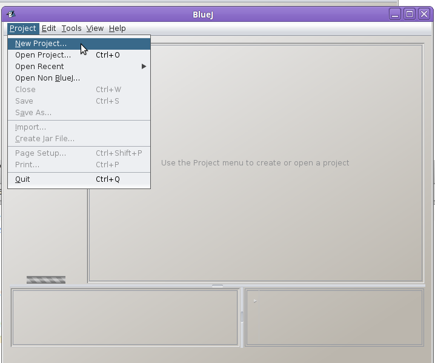
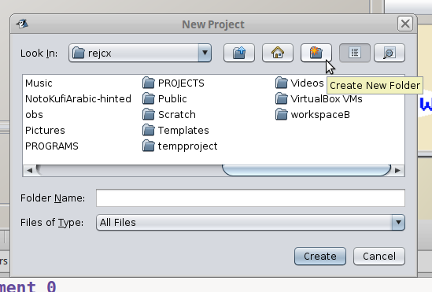
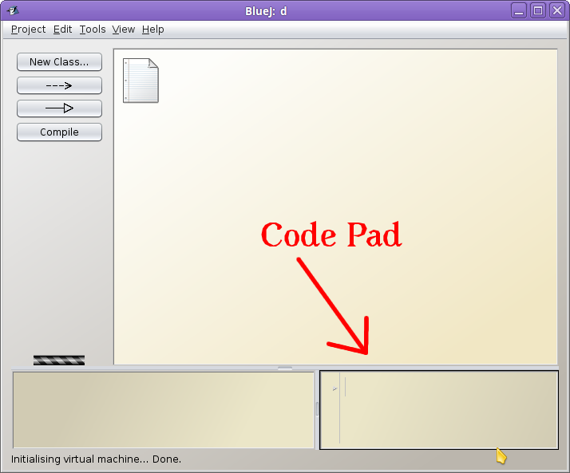

# CS 134 - CodePad Lab 1
## Data Types, Math Operators, and the Assignment Operator

Last updated 2016-08-25

---

# Introduction

We are going to explore some simple Java commands by using
the **CodePad** tool in the **BlueJ** program.

Each of these comands are single-line statements,
and after entering one statement, CodePad may display
some results - such as errors, updated variable values,
and more.

## What to turn in

Open a text editor (Notepad++, MS Word, etc.) and create a new document
for this lab. For each command listed in this document, you will type it
into the **CodePad** window and record the result.

Afterward, you will upload your document to the class Dropbox.

## Topics

* Valid and invalid variable names
* Math operators +, -, *, /, %
* Assignment operator =
* Math methods (square root, power)
* Integer class
* Invalid and bad code

---

# Getting Started

## 1. Open BlueJ

1. Click the "Start Menu" (in Windows 10, this looks like the Windows logo in the bottom-left corner of the screen),
2. Click on "All Apps" at the bottom of this menu.
3. Under the "B" section, open the "BlueJ" folder and select BlueJ.

## 2. Create a new project

1. From the BlueJ window, go to **Project** and select **New Project...**
2. Click on the **Create new folder** icon, and name it "Code Pad Lab 1".
3. Click on the **Create** button while your new folder is highlighted.

## 3. View CodePad

1. From BlueJ, go to **View** and select **Show Code Pad**.
2. You can resize the CodePad window by clicking and dragging its top and left borders.

---

# Trying out Java statements

## Section 1: A single variable

### Review

* A variable must have a **data-type** and a **name** specified
during its declaration.

* Java is a case-sensitive language, meaning that **data-types** need
to be written with correct casting in  order to work.

* There is also a **set of rules** that must be followed when naming
your variables:
  
  * A variable must begin wiht a letter (a-z, A-Z), underscore (_), or dollar sign ($).
  
  * You can include numbers in a variable name (0-9), but *not* as the first character.
  * The variable name can be *virtually* any length.
  
  * Reserved **keywords** cannot be used as variable names. For example: **int**, **for**, **if**.
  
  * Math equations must go on the **RHS** (Right-hand Side) of an equal sign.

### Statements to enter into CodePad

<table>
    <tr><th>#</th><th>Statement</th><th>Notes</th><th>What to write</th>
    
    <tr>
        <td> <!-- # --> 1 </td>
        <td> <!-- Statement -->
<pre>
int a;
</pre>
        </td>
        <td> <!-- Notes -->
            This is a valid variable declaration.
        </td>
        <td> <!-- What to write -->
        </td>
    </tr> <!-- /Row -->
    <tr>
        <td> <!-- # --> 2 </td>
        <td> <!-- Statement -->
<pre>
a = 10;
</pre>
        </td>
        <td> <!-- Notes -->
        This is a valid assignment statement.
        </td>
        <td> <!-- What to write -->
        </td>
    </tr> <!-- /Row -->
    <tr>
        <td> <!-- # --> 4 </td>
        <td> <!-- Statement -->
<pre>
a = a + 2;
</pre>
        </td>
        <td> <!-- Notes -->
        This will add 2 to the current value of "a".
        </td>
        <td> <!-- What to write -->
        </td>
    </tr> <!-- /Row -->
    <tr>
        <td> <!-- # --> 5 </td>
        <td> <!-- Statement -->
<pre>
a
</pre>
        </td>
        <td> <!-- Notes -->
        Just typing "a" by itself will output the value currently stored in "a".
        </td>
        <td> <!-- What to write -->
        The value of "a".
        </td>
    </tr> <!-- /Row -->
    
    <tr>
        <td> <!-- # --> 6 </td>
        <td> <!-- Statement -->
<pre>
a++;
</pre>
        </td>
        <td> <!-- Notes -->
        Adds 1 to the variable "a".
        </td>
        <td> <!-- What to write -->
        </td>
    </tr> <!-- /Row -->
    
    <tr>
        <td> <!-- # --> 7 </td>
        <td> <!-- Statement -->
<pre>
a
</pre>
        </td>
        <td> <!-- Notes -->
        
        </td>
        <td> <!-- What to write -->
        The value of "a".
        </td>
    </tr> <!-- /Row -->
    
    <tr>
        <td> <!-- # --> 8 </td>
        <td> <!-- Statement -->
<pre>
a += 5;
</pre>
        </td>
        <td> <!-- Notes -->
        Adds 5 to the variable "a".
        </td>
        <td> <!-- What to write -->
        </td>
    </tr> <!-- /Row -->
    
    <tr>
        <td> <!-- # --> 9 </td>
        <td> <!-- Statement -->
<pre>
a
</pre>
        </td>
        <td> <!-- Notes -->
        
        </td>
        <td> <!-- What to write -->
        The value of "a".
        </td>
    </tr> <!-- /Row -->
    

</table>

## Section 2: Multiple variables

### Review

Common Data Types:

* Integers - whole numbers (no decimal)

* Doubles, Floats - numbers with decimal

* String - Letters, numbers, symbols, anything. Value must be written within double-quotes ".

* Boolean - can only store the value of **true** or **false**.

### Statements to enter into CodePad

<table>
    <tr><th>#</th><th>Statement</th><th>Notes</th><th>What to write</th>
    
    
    <!-- ROW -->
    <tr>
        <td> <!-- # --> 10 </td>
        <td> <!-- Statement --><pre>
double price = 9.99;
        </pre></td>
        <td> <!-- Notes -->
        Declares a double variable and assigns it the value 9.99.
        </td>
        <td> <!-- What to write -->
        
        </td>
    </tr> 
    <!-- /ROW -->
    
    <!-- ROW -->
    <tr>
        <td> <!-- # --> 11 </td>
        <td> <!-- Statement --><pre>
int amountInStock = 5;
        </pre></td>
        <td> <!-- Notes -->
        Declares an integer variable and assigns it the value 5.
        </td>
        <td> <!-- What to write -->
        
        </td>
    </tr> 
    <!-- /ROW -->
    
    <!-- ROW -->
    <tr>
        <td> <!-- # --> 12 </td>
        <td> <!-- Statement --><pre>
double total = amountInStock * price;
        </pre></td>
        <td> <!-- Notes -->
        Declares a variable and stores the product of amountInStock * price.
        </td>
        <td> <!-- What to write -->
        
        </td>
    </tr> 
    <!-- /ROW -->
    
    <!-- ROW -->
    <tr>
        <td> <!-- # --> 13 </td>
        <td> <!-- Statement --><pre>
total
        </pre></td>
        <td> <!-- Notes -->
        Displays the value of the variable "total".
        </td>
        <td> <!-- What to write -->
        The value of "total".
        </td>
    </tr> 
    <!-- /ROW -->
    
    <!-- ROW -->
    <tr>
        <td> <!-- # --> 14 </td>
        <td> <!-- Statement --><pre>
String state = "Kansas";
        </pre></td>
        <td> <!-- Notes -->
        This declares a string variable named "state"
        and assigns it the value "Kansas".
        </td>
        <td> <!-- What to write -->
        
        </td>
    </tr> 
    <!-- /ROW -->
    
    <!-- ROW -->
    <tr>
        <td> <!-- # --> 15 </td>
        <td> <!-- Statement --><pre>
String city = "Overland Park";
        </pre></td>
        <td> <!-- Notes -->
        </td>
        <td> <!-- What to write -->
        
        </td>
    </tr> 
    <!-- /ROW -->
    
    
    <!-- ROW -->
    <tr>
        <td> <!-- # --> 16 </td>
        <td> <!-- Statement --><pre>
String location = city + state;
        </pre></td>
        <td> <!-- Notes -->
        Concatenates the values of the two strings together and stores it in the "location" variable.
        </td>
        <td> <!-- What to write -->
        
        </td>
    </tr> 
    <!-- /ROW -->
    
    <!-- ROW -->
    <tr>
        <td> <!-- # --> 17 </td>
        <td> <!-- Statement --><pre>
location
        </pre></td>
        <td> <!-- Notes -->
        Displays the value of "location".
        </td>
        <td> <!-- What to write -->
        The value of "location".
        </td>
    </tr> 
    <!-- /ROW -->
    
    
    <!-- ROW -->
    <tr>
        <td> <!-- # --> 18 </td>
        <td> <!-- Statement --><pre>
String location = city + ", " + state;
        </pre></td>
        <td> <!-- Notes -->
        Concatenates three strings together - the values of the
        city and state variables, as well as ", ", which is called
        a string literal.
        </td>
        <td> <!-- What to write -->
        
        </td>
    </tr> 
    <!-- /ROW -->
    
    <!-- ROW -->
    <tr>
        <td> <!-- # --> 19 </td>
        <td> <!-- Statement --><pre>
location
        </pre></td>
        <td> <!-- Notes -->
        Displays the value of "location".
        </td>
        <td> <!-- What to write -->
        The value of "location".
        </td>
    </tr> 
    <!-- /ROW -->
    
    

    
</table>

## Section 3: Math Expressions

Enter these expressions as-is into CodePad and record the result.

<table>
    <tr><th>#</th><th>Statement</th><th>Notes</th><th>What to write</th>
    
    
    <!-- ROW -->
    <tr>
        <td> <!-- # --> 20 </td>
        <td> <!-- Statement --><pre>
3 * 5 + 4
        </pre></td>
        <td> <!-- Notes -->
        Notice the order of operations.
        </td>
        <td> <!-- What to write -->
        The result
        </td>
    </tr> 
    <!-- /ROW -->
    
    <!-- ROW -->
    <tr>
        <td> <!-- # --> 21 </td>
        <td> <!-- Statement --><pre>
3 * ( 5 + 4 )
        </pre></td>
        <td> <!-- Notes -->
        Notice the order of operations.
        </td>
        <td> <!-- What to write -->
        The result
        </td>
    </tr> 
    <!-- /ROW -->
    
    
    <!-- ROW -->
    <tr>
        <td> <!-- # --> 22 </td>
        <td> <!-- Statement --><pre>
14/7
        </pre></td>
        <td> <!-- Notes -->
        
        </td>
        <td> <!-- What to write -->
        The result
        </td>
    </tr> 
    <!-- /ROW -->
    
    
    <!-- ROW -->
    <tr>
        <td> <!-- # --> 23 </td>
        <td> <!-- Statement --><pre>
14/6
        </pre></td>
        <td> <!-- Notes -->
        Notice that there's no remainder. That's because these are INTEGERS, not DOUBLES.
        </td>
        <td> <!-- What to write -->
        The result
        </td>
    </tr> 
    <!-- /ROW -->
    
    
    
    
    <!-- ROW -->
    <tr>
        <td> <!-- # --> 24 </td>
        <td> <!-- Statement --><pre>
14.0/5.0
        </pre></td>
        <td> <!-- Notes -->
        If you do the division with DOUBLES, then you will receive a DOUBLE as the result.
        </td>
        <td> <!-- What to write -->
        The result
        </td>
    </tr> 
    <!-- /ROW -->
    
    
    <!-- ROW -->
    <tr>
        <td> <!-- # --> 25 </td>
        <td> <!-- Statement --><pre>
1 + 2 + 3
        </pre></td>
        <td> <!-- Notes -->
        
        </td>
        <td> <!-- What to write -->
        The result
        </td>
    </tr> 
    <!-- /ROW -->
    
    <!-- ROW -->
    <tr>
        <td> <!-- # --> 26 </td>
        <td> <!-- Statement --><pre>
2 * ( 3 + 5 )
        </pre></td>
        <td> <!-- Notes -->
        
        </td>
        <td> <!-- What to write -->
        The result
        </td>
    </tr> 
    <!-- /ROW -->
    
    <!-- ROW -->
    <tr>
        <td> <!-- # --> 27 </td>
        <td> <!-- Statement --><pre>
Math.sqrt( 4 );
        </pre></td>
        <td> <!-- Notes -->
        To get the square root of a number, you need to use the Math.sqrt function.
        </td>
        <td> <!-- What to write -->
        The result
        </td>
    </tr> 
    <!-- /ROW -->
    
<!-- ROW -->
    <tr>
        <td> <!-- # --> 28 </td>
        <td> <!-- Statement --><pre>
Math.sqrt( 7 );
        </pre></td>
        <td> <!-- Notes -->
        
        </td>
        <td> <!-- What to write -->
        The result
        </td>
    </tr> 
<!-- /ROW -->
    
<!-- ROW -->
    <tr>
        <td> <!-- # --> 29 </td>
        <td> <!-- Statement --><pre>
Math.pow( 2, 3 );
        </pre></td>
        <td> <!-- Notes -->
        The Math.pow function gives you the value of some number, to some power. Here, it would be 2^3 (two to the third).
        </td>
        <td> <!-- What to write -->
        The result
        </td>
    </tr> 
<!-- /ROW -->
    
<!-- ROW -->
    <tr>
        <td> <!-- # --> 30 </td>
        <td> <!-- Statement --><pre>
Math.pow( 2, -2 );
        </pre></td>
        <td> <!-- Notes -->
        
        </td>
        <td> <!-- What to write -->
        The result
        </td>
    </tr> 
<!-- /ROW -->
    
    
</table>

## Section 4: Statements with Errors

The following statements will give you errors:

<table>
    <tr><th>#</th><th>Statement</th><th>Notes</th><th>What to write</th>
    
    
<!-- ROW -->
    <tr>
        <td> <!-- # --> 31 </td>
        <td> <!-- Statement --><pre>
INT x;
        </pre></td>
        <td> <!-- Notes -->
        INT is not a data type.
        </td>
        <td> <!-- What to write -->
        Error message, and how to fix the statement.
        </td>
    </tr> 
<!-- / -->

<!-- ROW -->
    <tr>
        <td> <!-- # --> 32 </td>
        <td> <!-- Statement --><pre>
int x
        </pre></td>
        <td> <!-- Notes -->
        Something is missing in the statement...
        </td>
        <td> <!-- What to write -->
        Error message, and how to fix the statement.
        </td>
    </tr> 
<!-- / -->

<!-- ROW -->
    <tr>
        <td> <!-- # --> 33 </td>
        <td> <!-- Statement --><pre>
double item-price;
        </pre></td>
        <td> <!-- Notes -->
        A certain character is not allowed in variable names...
        </td>
        <td> <!-- What to write -->
        Error message, and how to fix the statement.
        </td>
    </tr> 
<!-- / -->

<!-- ROW -->
    <tr>
        <td> <!-- # --> 34 </td>
        <td> <!-- Statement --><pre>
String jccc.edu;
        </pre></td>
        <td> <!-- Notes -->
        A certain character is not allowed in variable names...
        </td>
        <td> <!-- What to write -->
        Error message, and how to fix the statement.
        </td>
    </tr> 
<!-- / -->

<!-- ROW -->
    <tr>
        <td> <!-- # --> 35 </td>
        <td> <!-- Statement --><pre>
int cat count;
        </pre></td>
        <td> <!-- Notes -->
        What's wrong with the variable name?
        </td>
        <td> <!-- What to write -->
        Error message, and how to fix the statement.
        </td>
    </tr> 
<!-- / -->

<!-- ROW -->
    <tr>
        <td> <!-- # --> 36 </td>
        <td> <!-- Statement --><pre>
int 2days;
        </pre></td>
        <td> <!-- Notes -->
        What's wrong with the variable name?
        </td>
        <td> <!-- What to write -->
        Error message, and how to fix the statement.
        </td>
    </tr> 
<!-- / -->

<!-- ROW -->
    <tr>
        <td> <!-- # --> 37 </td>
        <td> <!-- Statement --><pre>
2( 6 )
        </pre></td>
        <td> <!-- Notes -->
        You need to have the multiplication operator here.
        </td>
        <td> <!-- What to write -->
        Error message, and how to fix the statement.
        </td>
    </tr> 
<!-- / -->

<!-- ROW -->
    <tr>
        <td> <!-- # --> 38 </td>
        <td> <!-- Statement --><pre>
100 + 1,400
        </pre></td>
        <td> <!-- Notes -->
        You cannot put a comma in numbers.
        </td>
        <td> <!-- What to write -->
        Error message, and how to fix the statement.
        </td>
    </tr> 
<!-- / -->
    
<!-- ROW -->
    <tr>
        <td> <!-- # --> 39 </td>
        <td> <!-- Statement --><pre>
Math.sqrt( -4 );
        </pre></td>
        <td> <!-- Notes -->
        Java, on its own, can't handle imaginary numbers.
        </td>
        <td> <!-- What to write -->
        The result
        </td>
    </tr> 
<!-- /ROW -->
    
<!-- ROW -->
    <tr>
        <td> <!-- # --> 40 </td>
        <td> <!-- Statement --><pre>
50 / 0;
        </pre></td>
        <td> <!-- Notes -->
        Division by 0 is invalid.
        </td>
        <td> <!-- What to write -->
        The result
        </td>
    </tr> 
<!-- /ROW -->
    
<!-- ROW -->
    <tr>
        <td> <!-- # --> 41 </td>
        <td> <!-- Statement --><pre>
50000*50000
        </pre></td>
        <td> <!-- Notes -->
        The result is too big for Java to store.
        </td>
        <td> <!-- What to write -->
        The result
        </td>
    </tr> 
<!-- /ROW -->

</table>
