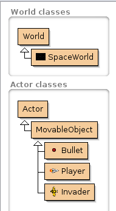

# Greenfoot Lab 6: Space Invaders

## Introduction

Please read this document in Chrome! :)

We will be building a Space Invaders clone from scratch this time around - 
no pre-made project to download.

## Turn-In

* Zip up your entire project folder and turn it in via Dropbox.

## Group Policy

You can collaborate with another student on this lab. Make sure to put
your teammate's name in the Dropbox comments when done.

--- 

# The Project!

## Creating the objects

First, let's just create all the objects we will use in the game.

* Create a subclass of the World called **SpaceWorld**
* Create a subclass of Actor called **MovableObject**.
This will contain the common code that all objects in the game use.
* As children of **MovableObject**, create the subclasses:
	* Bullet
	* Player
	* Invader

## MovableObject code

MovableObject contains the common code for all game objects - 
mainly, it has the movement code.

The player is controlled by keyboard input, the invaders follow their own path, and the bullet only moves upward. However, they all move, so we can use some common code.

1. Open up the editor for **MovableObject**,
2. Add a protected member variable called **speed**, of type **int**.
3. Create methods:
	1. **moveLeft()**
	2. **moveRight()**
	3. **moveUp()**
	4. **moveDown()**

Can you figure out how these methods should modify the object's X, Y coordinates? Try to implement these yourself – the code is on the next page.

	
<strong>
		**Solution**
	</strong>

	public class MovableObject extends Actor
	{
		protected int speed;
		
		void moveLeft()
		{
			setLocation( getX() - speed, getY() );
		}
		
		void moveRight()
		{
			setLocation( getX() + speed, getY() );
		}
		
		void moveUp()
		{
			setLocation( getX(), getY() - speed );
		}
		
		void moveDown()
		{
			setLocation( getX(), getY() + speed );
		}
	}

	

## Player movement

Next, let's add the movement code for the Player. Player inherits the variable speed from the MovableObject parent, so we can use this when our player moves.

Within the Player **constructor method**, make sure to initialize the speed to some value – perhaps 2.

Next, we're going to modify the act() class. By using...

	Greenfoot.isKeyDown( "left" ) and Greenfoot.isKeyDown( "right" )

...we can decide how to move the player left or right on the screen.

Can you implement this code on your own?

	
<strong>
		**Solution**
	</strong>

	public class Player extends MovableObject
	{    
		public Player()
		{
			speed = 2;
		}
		
		public void act() 
		{
			int x = getX();
			int y = getY();
			
			if ( Greenfoot.isKeyDown( "left" ) )
			{
				x -= speed;
			}
			else if ( Greenfoot.isKeyDown( "right" ) )
			{
				x += speed;
			}
			
			setLocation( x, y );
		}    
	}

	

We're going to add more functionality later, but for now here is how we can move the player!

Test the program by adding a new Player to the world, hitting Run, and moving left and right with the arrow keys!

## Invader movement

For the invader object, it also has access to the speed variable from its parent MovableObject.

We want the invaders to move to the right, hit the screen edge, then move left – and vice versa. Each time it changes direction, it should move downward a little bit. Eventually, if the invaders get to the bottom of the screen, it's game over!

Here's what we need to do:

* Create a variable to keep track of the direction that the invader is moving, so that when it hits the edge of the screen, it can reverse direction. What data type should this be?
* We need to initialize the invader's speed and it's direction flag in the Invader constructor
* We need to write code in the act() method so that the invader keeps moving in one direction. When it hits the edge, reverse the direction and move downwards.

There are always multiple ways to design solutions, so if you get something that works – that's good!

	
<strong>
		**Solution**
	</strong>

	
	import greenfoot.*; 

	public class Invader extends MovableObject
	{
		private boolean movingLeft;
		
		public Invader()
		{
			movingLeft = true;
			speed = 1;
		}
		
		public void act() 
		{
			int x = getX();
			int y = getY();
			
			if ( isAtEdge() )
			{
				movingLeft = !movingLeft;
				y += 50;
				setRotation( getRotation() + 180 );
			}
			
			if ( movingLeft )
			{
				x -= speed;
			}
			else
			{
				x += speed;
			}
			if ( y > getWorld().getHeight() - 50 )
			{
				SpaceWorld world = (SpaceWorld)getWorld();
				world.youLose();
			}
			setLocation( x, y );
		}    
	}

	

## Working with SpaceWorld

Now let's work on the world a little bit, now that we have player and invader movement. We need to set up the world, such as placing the player and multiple enemies, and displaying text to the screen.

We will need the following member variables (private):

* score (int)
* player (Player)

And the following member methods:

* SpaceWorld() constructor
* void act()
* void youWin()
* void youLose()

### In the constructor, we want to do the following:

* Display the text "Score:" and then the value of the score variable.
* Create a new Player() object, using the player variable. Set its rotation to -90 to
get it to point upwards, and then add the object to the screen.
* Use a for-loop to create 2 rows and 5 columns of invaders.

### In the act() method:

* Get the invader count with 
	int invaderCount = getObjects(Invader.class).size();
* Draw text to the screen that displays how many invaders there are.
* If the invader count is 0, call the youWin() method.

### Other methods

In the youWin() method, just display the message “You win!” to the screen.

In the youLose() method, just display the message “You lose!” to the screen.

	
<strong>
		**Solution**
	</strong>

	
	public class SpaceWorld extends World
	{
		private int score;
		private Player player;
		
		public SpaceWorld()
		{
			super(600, 600, 1);
			showText( "Score: "+score, getWidth()-60, getHeight()-30 );
			
			// Create player
			player = new Player();
			player.setRotation( -90 );
			addObject( player, getWidth() / 2, getHeight() - 100 );
			
			// Create a series of invaders
			for ( int y = 1; y < 3; y++ )
			{
				for ( int x = 1; x < 6; x++ )
				{
					addObject( new Invader(), x * 100, y * 100 );
				}
			}
		}
		
		public void act()
		{
			int invaderCount = getObjects(Invader.class).size();
			showText( "Invaders: "+invaderCount, 100, getHeight()-30 );
			
			if ( invaderCount == 0 )
			{
				youWin();
			}
		}
		
		public void youWin()
		{
			showText( "You win!", getWidth() / 2, getHeight() / 2 );
		}
		
		public void youLose()
		{
			showText( "You lose!", getWidth() / 2, getHeight() / 2 );
		}
	}

	

## Adding bullets

Next we'll need to modify Player and SpaceWorld to add bullets, as well as write the behavior code for the Bullet class itself.

When the player hits the Space Bar, it should make a bullet. The bullet should appear where the player is currently sitting, and once it exists, it should fly to the top of the screen.

If it goes off the top of the screen, it is destroyed and removed from the world. If it hits an invader, the invader and the bullet are removed.

In SpaceWorld, add a new method to add a new bullet:

    public void addBullet( int x, int y )
    {
        addObject( new Bullet(), x, y );
    }
    
In Player, we'll want to add another member variable – bulletCooldown. This should be an integer. In the constructor for Player, make sure to set bulletCooldown to 0.

Then, within the Player's act() method, underneath the checks for left and right keyboard input, check for space bar as well:

    if ( Greenfoot.isKeyDown( "space" ) && bulletCooldown == 0 )
    {
        SpaceWorld world = (SpaceWorld)getWorld();
        world.addBullet( x, y );
        bulletCooldown = 50;
    }

We add a cooldown so that the player cannot shoot an infinite amount of bullets all at once – where is the challenge in that? :)

With the bulletCountdown, we need to also make sure to subtract from the countdown timer
every cycle of the game.

Add this to the act() method after checking for the space:

	if ( bulletCooldown > 0 )
	{
		bulletCooldown--;
	}

In the Bullet class, we need to add its functionality.

### Bullet constructor: 

* Initialize its speed to 4.

### boolean checkIsOffScreen():

* Check to see if the bullet is at the edge of the screen
* If it is, tell the world to remove **this** object, and return true.
* Otherwise, return false.
	
### boolean checkCollisionWithInvader():

* Get the invader that the bullet is colliding with via the code: 
Invader collideInvader = (Invader)getOneIntersectingObject(Invader.class);
* Check to see if collideInvader is null
	* If it's null, the bullet hasn't hit anything, so return false.
	* Otherwise, if it IS null, the bullet has hit an invader. Tell the world to remove the invader
	and **this** bullet item, and return true.
		
### act() method:

* Each cycle, it should move upwards, so call moveUp() at the start of act().
* Then, we should check to see if the bullet is off-screen or has hit an enemy:
	* If checkIsOffScreen() returns true, or if checkCollisionWithInvader() returns true,
	then have the act() method return.
	
Note that void methods can return – they don't return a value, they simply exit the method.

	
<strong>
		**Solution**
	</strong>

	
	public class Bullet extends MovableObject
	{
		public Bullet()
		{
			speed = 4;
		}
		
		public void act() 
		{
			moveUp();
			if ( checkIsOffScreen() || checkCollisionWithInvader() )
			{
				return;
			}
		}    
		
		public boolean checkIsOffScreen()
		{
			if ( isAtEdge() )
			{
				getWorld().removeObject( this );
				return true;
			}
			return false;
		}
		
		public boolean checkCollisionWithInvader()
		{
			Invader collideInvader = 
			(Invader)getOneIntersectingObject(Invader.class);  
			if ( collideInvader != null )
			{
				getWorld().removeObject( collideInvader );
				getWorld().removeObject( this );
				return true;
			}
			return false;
		}
	}

## Testing

Test the program to make sure the player can move and shoot. Make sure that if the invaders get to the bottom of the screen, it displays “You lose”, and if the player destroys all the enemies, it displays “You win”.

You might adjust how many enemies are generated, how often the player can shoot, how fast the enemies move, etc. in order to change the difficulty of the game.

