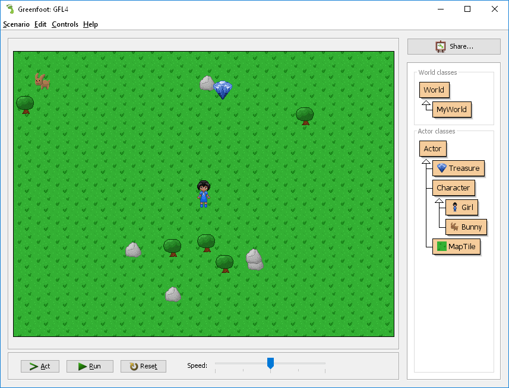
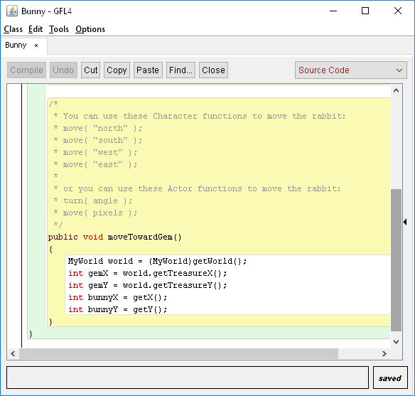
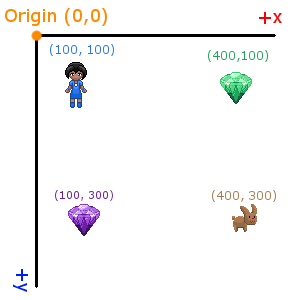

# CS 134 - Greenfoot Lab 4

## Get the Gem game

Last updated 2016-09-08 (happy birthday mom)

---

# Introduction

## What to turn in 

Open a text editor (Notepad++, MS Word, etc.) and create a new document for this lab. 
For each numbered question in this document, write down the number and your answer in your answer-sheet.

Afterward, you will upload your document to the class Dropbox.

## Topics

* Methods/Functions
* Variables
* Data Types
* Writing and Calling Functions

---

# Getting Started

Download the project "GFL4" and unzip it onto your desktop.
Open the project via the "project.greenfoot" file.

Test it out by hitting **Run**

## Gameplay

* Move the girl with the arrow keys
* Collect the gem
* After 5 points, you win the game

---

# Challenge 1: Bunny A.I.

At the moment, there is also a Bunny object, but it is not moving around. It can also collect gems but doesn't have any code to handle its movement.

Open the code editor for the Bunny object. There is already a little bit of code written, but we will be editing the **moveTowardGem()** method:

The code that is already in there is to get the (x,y) coordinates for both the gem and the bunny. Using these two coordinates, you can help the bunny decide which direction to travel in.

## The XY Coordinate Plane on computers

The coordinate plane on computers is a little different than in your algebra class, mostly because the way computers draw to the screen (from the top, downward).

For computers, the top-left corner of the screen is the **origin**, at (0, 0).

* The further to the **right** you go, the higher **x** is.
* The further **down** you go, the higher **y** is.

So for a character, if you're deciding how to move them:

1. Moving left (west) = subtracting from x
2. Moving right (east) = adding to x
3. Moving up (north) = subtracting from y
4. Moving down (south) = adding to y

## Adding Bunny brains

So this first challenge is to add code in **moveTowardGem()**
so that when the game is running, the bunny will be moving towards the gem.

### Hints

* Compare the gem's X and the bunny's X - if the gemX is less than bunnyX, then which way should bunny move?
* Do the same for Y.
* If you want to see how the *move()* function is used, check in the Girl's code, under the *act()* method.

---

# Challenge 2: Adding more items to collect

Right now there is only one treasure in the game.