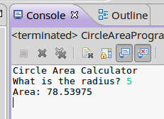
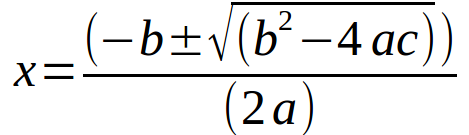
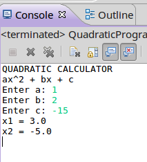

# Java Lab 1: Math Programs

## Introduction

Please read this document in Chrome! :)

This project will contain several small programs that
use math formulas, input, and output.

### Topics

* Eclipse / BlueJ
* Text output
* Text input
* Math operators

## Turn-In

Turn in all .java file(s) to the dropbox.

## Group Policy

You can collaborate with another student on this lab. Make sure to put your teammate's name in the Dropbox comments when done.

---

# Review: Creating a BlueJ project

## Create the project

1. Open BlueJ
2. Go to Project > New Project...
3. Create a folder for the assignment, then click **Create**.

## Create the class file

Each program will have its own class, such as "AreaProgram".

1. Click on **New Class...**
2. Set a Class Name
3. Click **Ok**

It will generate default code, most of which you will erase.
Right-click on your class program "box" that was created in BlueJ, and
select **Open Editor**.
Clear out everything except for the class declaration. For example:

	public class AreaProgram
	{
	}

## Create the entry method

Within this new class, you will create a **main** function, which will be the entry point of your program:

	public class MyProgram {
		public static void main(String[] args)
		{
			// Code goes here
		}
	}
	
This source file ends with **.java** after the class name, and this is the file
you can use to upload your work.

## Run the program

When you're ready to run your program, go back to the main BlueJ program,
right-click your class, and select the **main** function.

It will ask for input, and just leave it at the default { }. Click **Ok**.

An output window should pop up with your program.

# Review: Creating an Eclipse project

## Create the project

1. In Eclipse, it will ask you for a location for your workspace. The default is fine.
1. Go to **File > New > Project...**
1. Select Java Project.
1. Give your project a name, and otherwise use default values. Click **Finish**.

## Create the class file

1. To the left side of the window, there should be a **Package Explorer**. You might have to click an icon on the left side to get it to appear.
1. Right-click on the project folder and select **New > Class...**
1. Set the **Name** of your class. This lab has several programs, so make this class based on which program.
1. Leave the rest of the fields as defaults. Click **Finish**.

## Create the entry method

Within this new class, you will create a **main** function, which will be the entry point of your program:

	public class MyProgram {
		public static void main(String[] args)
		{
			// Code goes here
		}
	}
	
This source file ends with **.java** after the class name, and this is the file
you can use to upload your work.

---

# Program 1: Area and Perimeter of a rectangle

**Class file: AreaPerimeterProgram**

Start out with the following base program:

	
	import java.util.Scanner;

	public class AreaPerimeterProgram {
		public static void main(String args[])
		{
			Scanner scanner = new Scanner( System.in );
			
			// your code goes here
			
			scanner.close();
		}
	}

The **Scanner** object is so that we can get the user's input. The variable
name for this Scanner is "scanner" (lower-case), so we will utilize this
lower-case **scanner** name when we need to get user input.

**Output:** Using **System.out.println**, display the program's name: "Area and Perimeter Calculator"

	System.out.println( "Area and Perimeter Calculator" );

**Variable declarations:** Create three variables within your main function: width, length, area, and perimeter.
All of these should be **doubles**.

	double width, length, area, perimeter;

**Output:** Ask the user to enter the width.

**Input:** Get double input and store it in *width*.

	System.out.print( "What is the width? " );
	width = scanner.nextDouble();

**Output:** Ask the user to enter the height.

**Input:** Get double input and store it in *height*.

**Calculate:** Calculate the area of the rectangle:

	area = width * length;

**Calculate:** Calculate the perimeter of the rectangle (sum of all edges of the rectangle).

**Output:** Display the area and the perimeter of the rectangle. Make sure to label each item.

	System.out.println( "Area: " + area );
	System.out.println( "Perimeter: " + perimeter );

## Sample output

	
<h2>
		VIEW SOLUTION
	</h2>

	import java.util.Scanner;

	public class AreaPerimeterProgram {
		public static void main(String args[])
		{
			Scanner scanner = new Scanner( System.in );
			
			double width, length, area, perimeter;
			
			System.out.println( "Area and Perimeter Calculator" );
			
			System.out.print( "What is the width? " );
			width = scanner.nextDouble();
			
			System.out.print( "What is the length? " );
			length = scanner.nextDouble();
		
			area = width * length;
			perimeter = 2 * width + 2 * length;

			System.out.println( "Area: " + area );
			System.out.println( "Perimeter: " + perimeter );
			
			scanner.close();
		}
	}

---

# Program 2: Area of a circle

Create a new project for this program.

**Class file: CircleAreaProgram**

The formula for the area of a circle is:

*area = π r2*

so we will be using the **Math.pow** function that is part of Java in order
to calculate this equation.

Start out with the base program:

import java.util.Scanner;

	public class CircleAreaProgram {
		public static void main(String args[])
		{
			Scanner scanner = new Scanner( System.in );
			
			// Code goes here
			
			scanner.close();
		}
	}

**Output:** Using **System.out.println**, display the program's name: "Circle Area Calculator"

**Variable declarations:** Declare three variables, who are all doubles: pi, r, and area.

**Assign:** pi should be assigned the value of 3.14.

**Output:** Ask the user to enter the radius.

**Input:** Get double input and store it in *r*.

**Calculate:** Calculate the area of the circle using Java's Math.pow function.

	RESULT = Math.pow( BASE, EXPONANT );
	
	area = pi * Math.pow( r, 2 );
	
**Output:** Display the label "Area:", and then display the calculated area of the circle.

## Sample output

	
<h2>
		VIEW SOLUTION
	</h2>

	import java.util.Scanner;

	public class CircleAreaProgram {
		public static void main(String args[])
		{
			Scanner scanner = new Scanner( System.in );
			
			double pi = 3.14159;
			double r;
			double area;
			
			System.out.println( "Circle Area Calculator" );
			
			System.out.print( "What is the radius? " );
			r = scanner.nextDouble();
			
			area = pi * Math.pow( r, 2 );
			
			System.out.println( "Area: " + area );
			
			scanner.close();
		}
	}

---

# Program 3: Quadratic formula

Create a new project for this program.

**Class file: QuadraticProgram**

Start off the program with:

import java.util.Scanner;

	public class QuadraticProgram {
		public static void main(String args[])
		{
			Scanner scanner = new Scanner( System.in );
			
			// Code
			
			scanner.close();
		}
	}

Display the name of the program, as well as the format of a polynomial used
for the quadratic equation:

	System.out.println( "ax^2 + bx + c" );
	
Declare three variables: a, b, and c. All of them are doubles.

Ask the user to enter each item. Make sure to prompt the user
for input, and tell them what they will be inputting.

Declare two new variables: x1 and x2.

For these calculations, we will need Java's sqrt function:

	Math.sqrt( THING )
	
Try to calculate x1 and x2 using the quadratic formula written above.
You'll want to use parenthesis to explicitly specify the order of operations,
and remember that you can't write numbers like *4ac* in programming,
you have to put asterisks between each term.

	
<h2>
		Mini-solution: Quadratic formula
	</h2>

	x1 = (-b + Math.sqrt(b*b - 4*a*c))/(2*a);
	x2 = (-b - Math.sqrt(b*b - 4*a*c))/(2*a);

After calculating the x1 and x2, display them to the screen with
the appropriate labels.

## Sample output

	
<h2>
		VIEW SOLUTION
	</h2>

	import java.util.Scanner;

	public class QuadraticProgram {
		public static void main(String args[])
		{
			Scanner scanner = new Scanner( System.in );
			
			System.out.println( "QUADRATIC CALCULATOR" );
			System.out.println( "ax^2 + bx + c" );
			
			double a, b, c;
			
			System.out.print( "Enter a: " );
			a = scanner.nextDouble();
			
			System.out.print( "Enter b: " );
			b = scanner.nextDouble();
			
			System.out.print( "Enter c: " );
			c = scanner.nextDouble();
			
			double x1, x2;

			x1 = (-b + Math.sqrt(b*b - 4*a*c))/(2*a);
			x2 = (-b - Math.sqrt(b*b - 4*a*c))/(2*a);
			
			System.out.println( "x1 = " + x1 );
			System.out.println( "x2 = " + x2 );
			
			scanner.close();
		}
	}

