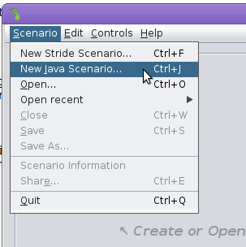
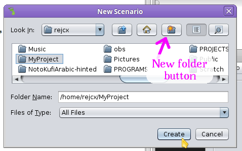
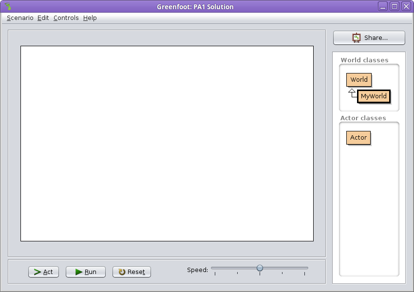
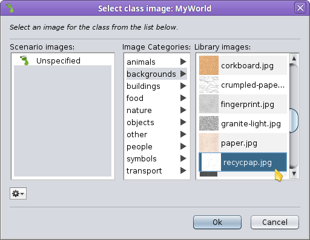
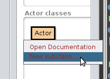
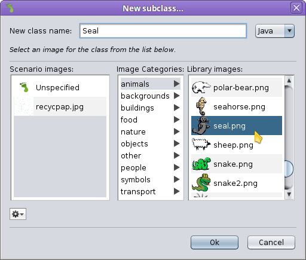
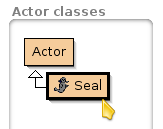

# CS 134 Programming Assignment 1: Intro to Greenfoot

## Introduction

This assignment is to get you acquainted with the interface of
Greenfoot and doing some basic operations.

### Review

* Chapter 1: Getting to know Greenfoot
* Chapter 2: The first program: Little Crab

## Turn-In

Once you are done with your assignment, zip your **entire** project
folder and submit the .zip file to the class Dropbox.

---

# Setting Up

When you first open up Greenfoot, it might be empty, or it might open 
up with a project already loaded (usually the last project opened).
Make sure you **create a new project** through **Scenario > New Java Scenario...**
(Note, with older versions, this might just be "New Scenario").

To create a project, you need to create a new folder first.
Create a new folder anywhere on your computer (it must be empty),
navigate into it, then click **Create** to create the project.

Once your project is created, you will have a blank canvas, and
nothing listed under **Actor** (right-hand side), and the default
**MyWorld** under **World**.

# Setting up the World

Right-click on the **MyWorld** object, and select **Set image...**

Greenfoot comes with a bunch of pre-made graphics. Browse through
the categories and select an image. Hit **Ok** when done.

# Creating an Actor

Under the **Actor classes** section, there is only the parent class of object
called "Actor".
    

We can create a new type of Actor by right-clicking on the **Actor**
class and selecting **New subclass...**.
This will allow us to create a new *type* of Actor.

Go through the categories and look at the graphics provided in Greenfoot.
Select an image that you want to put into your game, and give the class
a name (under **New class name:**)

Your new Actor subclass will show up under **Actor**.

## Terminology Review

> **What is a class?**

In programming, we create objects. Objects contain a set of functionality and attributes.

In order to create a new Object, we have to define what the object will contain. We do this
by making **classes** of objects.

So when we want to create a new "Player" object in a game, we first need
to create a class named "Player".

> **What is a subclass?**

A subclass is a type of **class**. Sometimes, subclasses are known as **child classes**, because they inherit
functionality and attributes from the **parent class** (aka superclass).

Child classes can contain their own functionality and attributes, but 
they also "pull down" functionality and attributes from their parent.

# Working with the Actor
