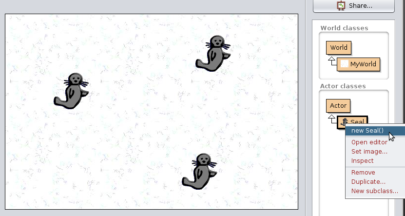
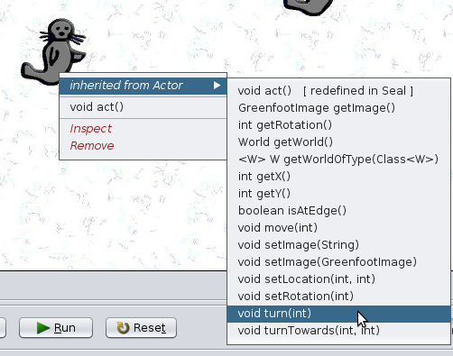
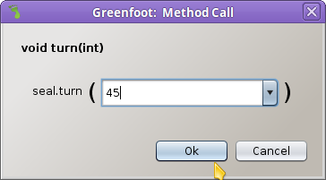
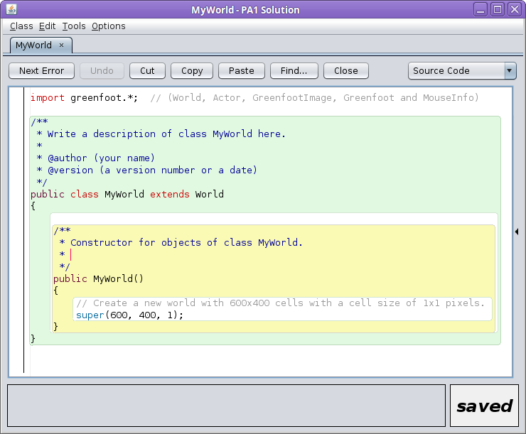
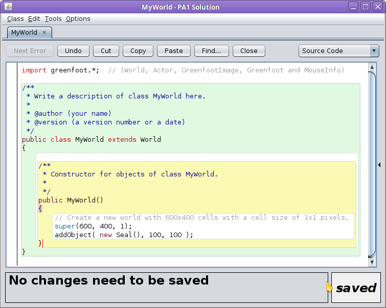
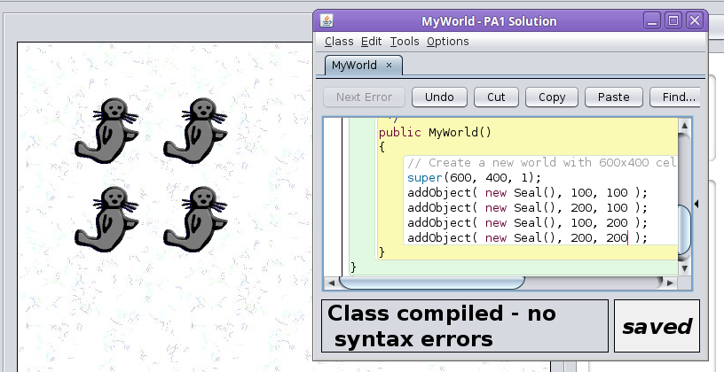
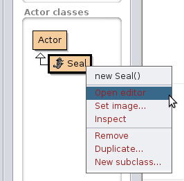
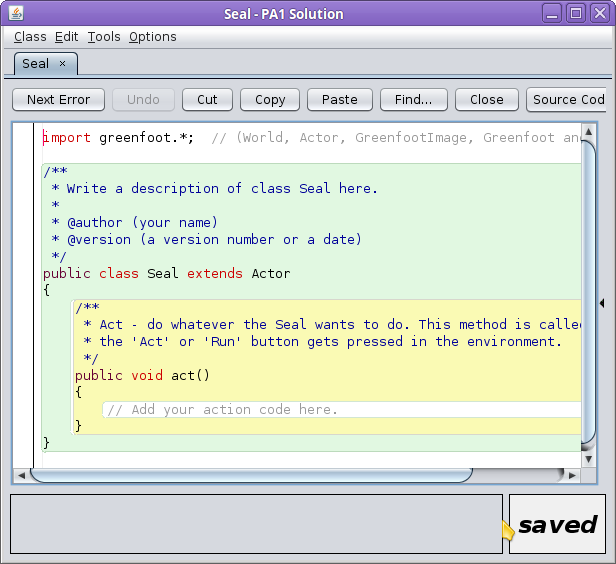
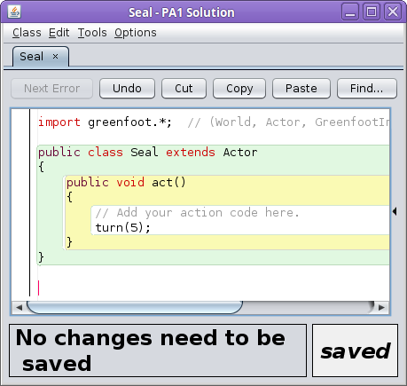
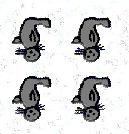

# CS 134 Programming Assignment 1: Intro to Greenfoot

## Introduction

This assignment is to get you acquainted with the interface of
Greenfoot and doing some basic operations.

### Review

* Chapter 1: Getting to know Greenfoot
* Chapter 2: The first program: Little Crab

## Turn-In

Once you are done with your assignment, zip your **entire** project
folder and submit the .zip file to the class Dropbox.

---

# Setting Up

When you first open up Greenfoot, it might be empty, or it might open 
up with a project already loaded (usually the last project opened).
Make sure you **create a new project** through **Scenario > New Java Scenario...**
(Note, with older versions, this might just be "New Scenario").

To create a project, you need to create a new folder first.
Create a new folder anywhere on your computer (it must be empty),
navigate into it, then click **Create** to create the project.

Once your project is created, you will have a blank canvas, and
nothing listed under **Actor** (right-hand side), and the default
**MyWorld** under **World**.

# Setting up the World

Right-click on the **MyWorld** object, and select **Set image...**

Greenfoot comes with a bunch of pre-made graphics. Browse through
the categories and select an image. Hit **Ok** when done.

# Creating an Actor

Under the **Actor classes** section, there is only the parent class of object
called "Actor".
    

We can create a new type of Actor by right-clicking on the **Actor**
class and selecting **New subclass...**.
This will allow us to create a new *type* of Actor.

Go through the categories and look at the graphics provided in Greenfoot.
Select an image that you want to put into your game, and give the class
a name (under **New class name:**)

Your new Actor subclass will show up under **Actor**.

## Terminology Review

### What is a class?

> In programming, we create objects. Objects contain a set of functionality and attributes.

> In order to create a new Object, we have to define what the object will contain. We do this
by making **classes** of objects.

> So when we want to create a new "Player" object in a game, we first need
to create a class named "Player".

### What is a subclass?

> A subclass is a type of **class**. Sometimes, subclasses are known as **child classes**, because they inherit
functionality and attributes from the **parent class** (aka superclass).

> Child classes can contain their own functionality and attributes, but 
they also "pull down" functionality and attributes from their parent.

# Working with the Actor

Right now, no Actors are in the World. We can manually add our Actor to
the world by right-clicking it, and selecting **new Seal()** (or whatever
your class' name is).

It will then be attached to your mouse, and you can place it in the world.

At the moment, nothing is programmed to happen, but we can manually
call **functions** that our Actor contains.

If you right-click on an Actor in the world, a pop-up menu shows up.

Under the **inherited from Actor** submenu, there are several options,
such as **turn** and **setLocation**.

Click on **void turn(int)**, and a dialog box will pop up, asking for
an angle. Enter a value between 0 and 360, and hit **Ok**.

# Coding

These functions can also be called from **code**, rather than from
the user interface.

So far, we have not done any coding. Let's set up the program so that:

1. The World adds a new Actor automatically when the program starts.
2. The Actor rotates continuously while the program is running.

First note that at the bottom of the Greenfoot window are several buttons:

**Reset** will clear out the world and reset it. Any code that is written
in a **constructor method** will be executed, and it only gets executed
when the program resets.

**Run** will run the game until paused. Each cycle in the game,
each World and Actor's **act** functions are called. Right now,
we don't have any code in these.

If you click **Reset** right now, your Actor will disappear from the World.
We can continue adding the Actor to the world manually, but each time
the world is reset it will go away.

In order to have our Actor show up **automatically** whenever the world is
reset, we need to add some code to the World to say,
"Add a new object to the world".

Right-click on your **MyWorld** object, and select **Open Editor**.
This will pop up a code window, and some code has already been added:

We are just going to work with one part of the code right now...

## public MyWorld()

This "public MyWorld()" section of the code is a **function**.
Within a function, we can define *functionality*; i.e., we can add
commands to be executed any time the function is called.

Other examples of functions are the **turn** function we used earlier.

This function is special, because it is called **MyWorld**. It shares
a name with the class itself ("MyWorld"). Because of this, this function
is the **constructor function**, which gets called any time the world is
Reset.

There is already some code within the world: 

    super(600, 400, 1); 
    
This is a function call, but we will talk about it in another lesson.
For now, just take it for granted.

We are going to add code underneath **super** which will add our
Object to the game world. Add in the following line of code after **super**:

    addObject( new Seal(), 100, 100 );
    
but remember to replace Seal() with whatever you named *your* class.

With the **addObject** function, we are telling it:

1. What KIND of object to add (Seal())
2. The X-Coordinate of the object
3. The Y-Coordinate of the object

Duplicate this **addObject** line a few times, and change the X and Y
coordinates to other regions of the world.

(Note: the world is only 600 x 400.)

Back in the main window of Greenfoot, once the game is reset, you
should see your new objects pop up:

## Test!

Make sure that the functionality works at this point!
If you have a compile error, you need to **debug it** before moving on!

# Spinning

Next, we're going to change the code for our Actor object, so that
they will spin while the program is running.

Right-click on your Actor subclass (mine is Seal) and select **Open editor**.
Again, some code has already been added automatically:

Here, we're interested in the **act()** function.

## public void act()

In this function, we can use **turn** on all versions of our Seal (or whatever
your actor is). Under the comment "// Add your action code here.", add:

    turn( 5 );

This will turn the actor by 5-degrees each cycle through the game.

## Test

Hit the **compile** button and go back to the main window.

Click on **Run** to make sure that each actor spins.

