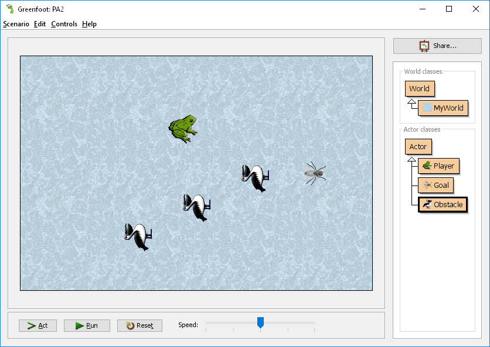
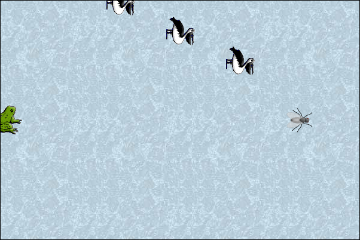
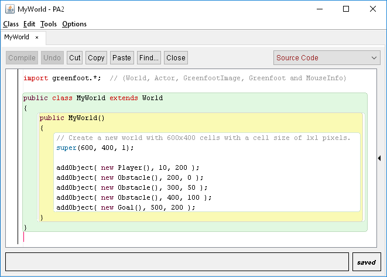
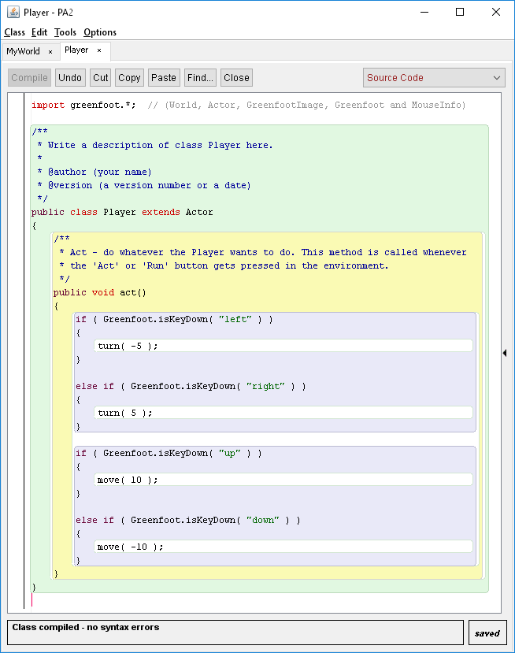
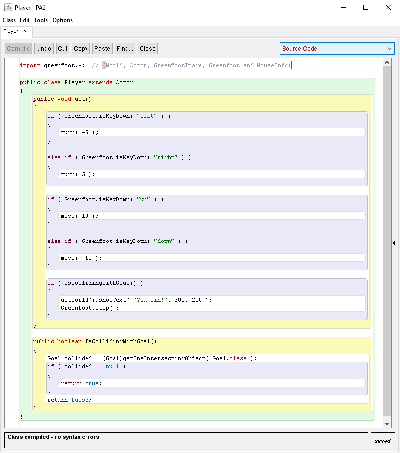
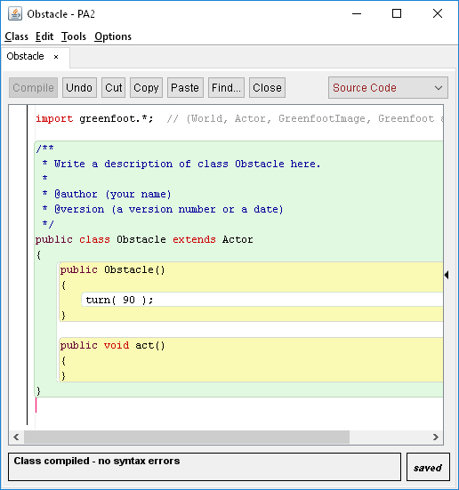
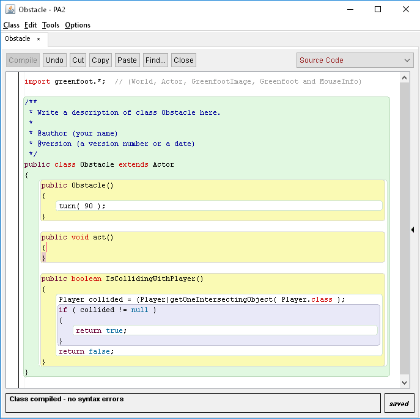
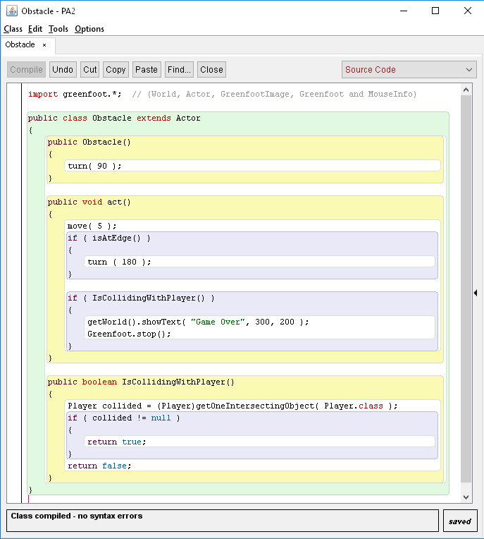

# CS 134 Programming Assignment 2: Frog 'n' Fly

## Introduction

This assignment is to build a simple game where you have to get the frog over to the fly without touching a pelican. If you touch a pelican, you lose. If you get over to the fly, you win.

### Review

* Chapter 1: Getting to know Greenfoot
* Chapter 2: The first program: Little Crab
* Chapter 3: Improving the crab: more sophisticated programming

## Turn-In

Once you are done with your assignment, zip your entire project folder and submit the .zip file to the class Dropbox.

---

# Setting Up

## Creating a new project

See [PA1](https://github.com/Rachels-Courses/CS134-Programming-Fundamentals/blob/master/Assignments/Programming%20Assignments/PA1%20Intro%20to%20Greenfoot.md) if you need screenshots and step-by-step instructions on creating a Greenfoot project.

1. Open Greenfoot
2. Go to Scenario > New Java Scenario...
3. Create a new folder on your computer (for example, on the Desktop, save "PA2").
4. Select your new folder and click **Create**

## Set up the world

1. Right-click on the "MyWorld" class under the **World classes** pane. Choose "Select image..."
2. Choose a background image for the game

## Set up your Actors

### Player

1. Right-click on the "Actor" class under the **Actor classes** pane. Choose "New subclass..."
2. Set the **New class name** to "Player", select an image for the player (in my screenshots, it is a frog.). Hit **Ok**.

### Goal

1. Right-click on the "Actor" class under the **Actor classes** pane. Choose "New subclass..."
2. Set the **New class name** to "Goak", select an image for the player (in my screenshots, it is a fly.). Hit **Ok**.

### Obstacle

1. Right-click on the "Actor" class under the **Actor classes** pane. Choose "New subclass..."
2. Set the **New class name** to "Obstacle", select an image for the player (in my screenshots, it is a pelican.). Hit **Ok**.

---

# Adding Code

Now that we have all the Actors we will use in our game, it is time to start adding some code. Follow along step-by-step in order to complete the game.

## 1. Adding all objects to the world

### Introduction to the code

Right-click on the **MyWorld** class, and select "Open editor".

Code has been automatically generated, and we will be editing code in the **MyWorld** constructor method.

A **method** begins at its signature:

	public MyWorld()

* **public** means any Actor or World can access the method (anyone can create a MyWorld)
* **MyWorld()** is the name of the method. This is a special method because it shares its name with the class ("class MyWorld"). It is known as a **constructor** method.
* You can tell which methods are constructors, because they always have the same name as the class.
* Constructor methods are called immediately when the object is created (The World, or if we're writing an actor, an Actor.)

We are going to add code **inside** of the method. We can tell what is inside the method by the opening and closing curly-braces:

	// Outside of the method

    public MyWorld()
    {    
        // Inside of the method
    }

	// Outside of the method

Within the method, it already has some default code:

    public MyWorld()
    {    
        // Create a new world with 600x400 cells with a cell size of 1x1 pixels.
        super(600, 400, 1); 
    }

This code basically creates the game screen, so don't remove it. We will be adding code **after** this "super" function call.

### Using the addObject method

World objects have a function called **addObject**. We can use this to add Actors to our game screen. Any actors we add in the **MyWorld** constructor method will be added after each game **Restart**, so we don't have to manually add them to the game.

Here is the outline of the function:

	addObject( [ACTOR NAME], [X COORDINATE], [Y COORDINATE] );

So, for example, if we want to add the Player to the screen, we use:

	addObject( new Player(), 10, 200 );

We are adding a new Player (don't forget the parenthesis!), and we're doing it at (10, 200) on the coordinate system.

Add the following objects to the screen using the same function:

* a new Goal at ( 500, 200 )
* a new Obstacle at ( 200, 0 )
* a new Obstacle at ( 300, 50 )
* a new Obstacle at ( 400, 100 )

Notice that we can add multiple of each type of actor, but for now we only want one player, one goal, but multiple enemies.

After the game refreshes, your window should look like this:

If you need the code for reference, here is the full code of MyWorld:

**Make sure to go back into the main Greenfoot window, make sure it resets and works properly! Don't continue until the code works!**

If you're getting an error, check the following:

* After **new**, do you have the actor name spelled right, and parenthesis after the actor name?
* Do you have all the commas in the proper places?
* Do you have a semicolon ; at the end of each line?
* Is your **super** method still there?

## 2. Adding keyboard movement for the Player

### Introduction to the code

Now we're going to add some code so that the player can move with the keyboard. Open the Editor for the **Player** actor.

Notice that there is already some code generated here, too. The method it gives you is **act()**:

* **public** means this method can be called from any Actor or World
* **void** means it does not return any information from the method
* **act** is the method name

### Using the Greenfoot.isKeyDown function

#### Rotating

We can use Greenfoot's special function **isKeyDown** to see if any of the keyboard keys are being pressed. We need to use an **if** statement as well, in order to create conditions where code will be executed *only if some condition is met*. For now, these conditions will be, "is the left arrow pressed?", "is the right arrow pressed?", "is the up arrow pressed?", and "is the down arrow pressed?".

Add the following code to inside your **act()** method (remember that inside the function means inside the { }!)

    public void act() 
    {
        if ( Greenfoot.isKeyDown( "left" ) )
        {
            turn( -5 );
        }
        
        else if ( Greenfoot.isKeyDown( "right" ) )
        {
            turn( 5 );
        }
    }    

Adding this code means that when the left or right arrow keys are pressed, the Player will rotate. If you've ever played the classic arcade game **Asteroids**, the frog will move similar to the ship in that game!

* **turn( -5 )** means rotate counter-clockwise 5 degrees.
* **turn( 5 )** means rotate clockwise 5 degrees.

**Test! Go back to Greenfoot, let it refresh, then hit "Run". Try to press the arrow keys and see if the player rotates!**

#### Moving

Next, we want to allow the player to move forward and backward if the up and down arrow keys are used.

Referencing the rotation code, write if statements for the following:

* if the "up" key is pressed...
* else if the "down" key is pressed...

Instead of using **turn()** within these if statements, instead we will use the **move()** function. Call **move( 10 )** to move forward, and **move( -10 )** to move backwards.

Try to assemble the code and test.

**Test! Let Greenfoot refresh, hit "Run", and try to move and turn with all the arrow keys!**

Here is the full code for reference:

#### Getting to the Fly

I've written some pre-written code to check whether the Player has gotten to the Goal. Don't worry about understanding this code right now, it is just to make it easier to check if they're colliding.

Add this function after the **act()** method's closing curly brace }.

    public boolean IsCollidingWithGoal()
    {
        Goal collided = (Goal)getOneIntersectingObject( Goal.class );
        if ( collided != null )
        {
            return true;
        }
        return false;
    }

Then, back within the **act()** method, let's add a check to see if the player got to the fly:

        if ( IsCollidingWithGoal() )
        {
            getWorld().showText( "You win!", 300, 200 );
            Greenfoot.stop();
        }

* This **IsCollidingWithPlayer** function is the one we pasted in earlier that was pre-written.
* The **showText** function can be used to draw text on the screen. Its input is: TEXT, X COORDINATE, Y COORDINATE.
* The **Greenfoot.stop()** function will cause the game to stop running.

Your code should look like this once completed:

## 3. Adding movement for the Obstacles

With the Player class, the player object moves based on the user's keyboard input. For the Obstacle class, these will be **NPCs** (Non-player characters), so we have to write in some **AI** (artificial intelligence) to have them move themselves.

Don't worry, these birds will be dumb, so they will be easy to program.

### Initializing the Obstacles

At the moment, the Obstacles are facing to the **right** by default, but we want them to move up and down, not left and right.

In order to fix this, we need to **add** a function! We need to add a constructor function.

Add the following **above** the **act()** method:

    public Obstacle()
    {
        turn( 90 );
    }

Your code editor should look like this:

* **turn( 90 )** means to turn downwards from its initial position.

### IsCollidingWithPlayer function

Next, we're going to add another function. You don't need to worry about the inner-workings of this function; I've pre-written it for you so we can check if the Obstacle and Player are colliding more easily.

Copy this into the code window after **act()** 's closing curly-brace:
   
    public boolean IsCollidingWithPlayer()
    {
        Player collided = (Player)getOneIntersectingObject( Player.class );
        if ( collided != null )
        {
            return true;
        }
        return false;
    }

Your code should look like this:

### act()

Now we're finally going to add in our AI for the Obstacles.

The obstacle will basically act like this:

* Move forward (when the game begins, "forward" is downwards)
* If I hit the edge of the screen, turn 180 degrees (face upwards)
* Keep moving forward...
* If I hit the edge of the screen, turn 180 degrees (face downwards)

So let's implement this in the code.

We can use the **move()** method to have the Obstacle move forward (forward based on whatever angle it's currently facing).

Within **act()**, add the following:

	 move( 5 );

You can make the speed faster by using a number larger than 5, or slower by using a number between 0 and 4.

Next, we need to see if it has hit the edge of the screen. Greenfoot gives us the function **isAtEdge()**, which will tell us **True** or **False** - we are at the edge, or we are not.

If we're at the edge, we want to turn around.

        if ( isAtEdge() )
        {
            turn ( 180 );
        }

That's all the movement code; if the Obstacle turns 180 degrees, next time the **act()** method is invoked, moving forward will be the opposite direction.

### Game Over

Let's also add code for if the Obstacle hits the Player - then we want to show the text "Game Over" and end the game.

Add the following code:

        if ( IsCollidingWithPlayer() )
        {
            getWorld().showText( "Game Over", 300, 200 );
            Greenfoot.stop();
        }

* This **IsCollidingWithPlayer** function is the one we pasted in earlier that was pre-written.
* The **showText** function can be used to draw text on the screen. Its input is: TEXT, X COORDINATE, Y COORDINATE.
* The **Greenfoot.stop()** function will cause the game to stop running.

When you're done with all the Obstacle's code, it should look like this:

## 4. Test!

Run the game, and test the following scenarios:

* The player rotates left and right when the left and right arrow keys are pressed.
* The player moves forward and backward when the up and down arrow keys are pressed.
* If the player touches an obstacle, it says "game over" and stops the game.
* If the player touches the fly, it says "you win' and stops the game.

After you've tested it to make sure it works properly, zip up the project and turn it in.