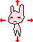

# CS 134 Programming Assignment 3: Your Game

## Introduction

You're going to create your own game, with the requiremenets specified.

## Turn-In

Once you are done with your assignment, zip your entire project folder and submit the .zip file to the class Dropbox.

You will also export your game via the "Share" feature, saved as an Application.

---

# About

For this assignment, you won't be following a guide on how to make
a pre-made game - you will be writing your own game.

However, your game must meet some of the requirements listed in this document.

This document also contains reference material (how to use keyboard, mouse, 
collision, etc.) that you can use to implement your features,
and also an ideas list / outline of how to implement certain game features.

You can also reference sample code from some pre-written Greenfoot games provided to help you make your own game.

You may modify a previous lab or programming assignment if you would like.

---

# Designing a game

Remember to **keep it simple**! Start by planning one feature at a time and go from there.
After each feature is added, you can add another and another,
but if you over-design and try to implement the entire thing at one time,
then you're bound to run into problems!

In short,

* Design, implement, and test one feature at a time.
* Don't over-design your game! Start small, and build up after you have the minimum done.

As an example, say you're implementing a Duck Hunt game. Here are some features...

1. Implement crosshairs - have the crosshair Actor follow the mouse.
2. Have ducks spawn at random intervals - have the World randomly add new ducks in the game at random locations.
3. Implement duck movement - move upwards at random angles.
4. Implement clicking ducks - add to score, remove duck from world.
5. Implement game over screen - if score is 10, you win.

---

# Required Features

These are the minimum specs for your game. Beyond these, you can decide
what other objects you want in your game, and the functionality.

## Classes:

### 1. At least two World classes

  * MenuWorld - Displays the game's name, instructions, and a play button
  * PlayWorld - The actual gameplay portion of the program.

You can also include more than one World if you want multiple levels or multiple gameplay types (but keep it simple!)

### 2. At least two Character (Actor) classes

  * One that is moved by the player, either with the mouse or keyboard
  * One that is moved by AI

**Character requirements:**

* Each character should have at least one member variable - for example, **score**, **hitPoints**, **lives**, etc.
* At least one Character should have functionality to handle when it collides with another Character.

You can also create a "parent" class (superclass) to contain the common
functionality between both characters if you would like.
  
### 3. At least one Button (Actor) class

This class should respond to being clicked, and execute some function
(such as starting the game, pausing the game, etc.)

**Button requirements:**

* Button should detect when it is clicked.
* Button should execute some functionality, such as telling the **World**
to go to the next World.

## Functionality:

### 4. Win / Lose state

Your game should have some criteria to be met in order for the game to be finished. There should be a "Win" state and a "Lose" state. For example, if the score reaches 10, the player might win. If health reaches 0%, the player might lose.

*Implementation: Generally requires an if statement.*

### 5. Button class

The button class should have a graphic that makes it look like a button, and it should also display text based on what kind of function it will execute (example: "Play", "Quit", etc.) - So, the button can use the showText method to draw different text on different buttons.

When clicked, the button should cause something to occur - for example, in the MenuWorld, it might cause the game to begin.

If you want to use multiple buttons, you might store a **String** member variable so that you can tell them apart and do different functions based on each button's name.

*Implementation: Creating a Button Actor, responding to mouse click*

### 6. Character classes

The character classes will be able to move around the screen and interact with each other. Characters might include the Player, the NPCs (Non-player Characters), and even Items that you could collect.

**At least one character should have a method to handle collision with a second character.**

### 7. Instructions screen

This may go on the Menu World, but you will need to display your game's
gameplay instructions (movement, how to win, how to lose) in your game.

You can do this as a background image, or by writing text with the showText method.

---

# Example Games for reference

You can read through these games' source code to try to figure out how
to implement your own project.

You can view the source code online here:

[Example Programs](https://github.com/Rachels-Courses/CS134-Programming-Fundamentals/tree/master/Resources/Example%20Programs/Greenfoot)

If you want to download the programs to your own computer, from
the [Repository front page](https://github.com/Rachels-Courses/CS134-Programming-Fundamentals),
click on the green **Clone or download** button, then select **Download ZIP**.

---

# How To...

Use this as a reference guide to work on your program.

## Draw text

The text drawing function belongs to the **World** class.

If you're in the world, you can draw text with:

	showText( "yourtext", x, y );
	
but if you're in an Actor class, you have to call it this way:

	getWorld().showText( "yourtext", x, y );

## Move my Actors

There are several ways you can move an Actor in Greenfoot.

Each actor has a rotation angle and X,Y coordinates.

### Asteroids-style

* Left and Right: Adjust rotation
* Up: Move forward
* Down: Move backward

The Actor class has these methods:

**1. void turn( int amount )**

You can turn your actor by calling turn and passing in an angle, in degrees:

	turn( 90 ); // turn 90 degrees

**2. void turnTowards( int x, int y )**

You can turn your actor towards a certain x,y coordinate by passing in the points:

	turnTowards( 100, 100 ); // Point towards (100, 100)

**3. void setRotation( int rotation )**

Instead of turning the character relative to its current facing direction,
you can set the rotation manually (0 to 360 degrees).

	setRotation( 180 );

**4. void move( int distance )**

Once an actor is rotated, the move function will move it in the direction it is facing.

	turn( 45 );
	move( 10 );

### Rotate-and-move

 

* Left: Turn left and move
* Right: Turn right and move
* Up: Turn up and move
* Down: Turn down and more

You can use the setRotation and move functions to turn your character
to face a certain direction and then move them forward.

	setRotation( 0 );
	move( 10 );
	
* 0 degrees - Right
* 180 degrees - Left
* 90 degrees - Down
* -90 degrees - Up

### Directly adjusting X,Y coordinates

* Left: Subtract from X
* Right: Add to X
* Up: Subtract from Y
* Down: Add to Y

If you don't want to deal with rotation, you can just directly change
a character's position by updating their x,y position.

First, you'll want to create some temporary variables to work with,
and store the actor's current position:

	int x = getX();
	int y = getY();

Then, you can adjust the x, y coordinates:

	x += speed;
	y += speed;
	
And finally you will want to make sure to update the actor's location:

	setLocation( x, y );

## Keyboard Input

To get keyboard input, you will use Greenfoot's isKeyDown method:

	if ( Greenfoot.isKeyDown( "up" ) ) 
	{
		// do "up" action
	}

Keys available:

* Arrow keys: "up", "down", "left", "right"
* Letter keys: "a" - "z"; lower-case letters.
* Number keys: 0 - 9
* Other buttons: "space", "backspace", "enter"

## Mouse Input

To get mouse clicks, you will first have to create a MouseInfo object:

	MouseInfo mouse = Greenfoot.getMouseInfo();

Before you do any operations on the *mouse*, you want to make sure it exists.
(The mouse won't exist if it's off screen, and if you try to call mouse
functions when it doesn't exist, your program will crash.)

	if ( mouse != null )
	{
		// Do your mouse operations here.
	}
	
Then, you can get the mouse coordinates, as well as what button is clicked.

### Which button?

	if ( mouse.getButton() == 1 ) // Left button
	{
	}
	else if ( mouse.getButton() == 2 ) // Middle button
	{
	}
	else if ( mouse.getButton() == 3 ) // Right button
	{
	}

### Where is the mouse?

	int x = mouse.getX();
	int y = mouse.getY();
	
### Was I clicked by the mouse?

You can also just check to see if the current Actor was clicked. This code
doesn't need the mouse object from above:

	if ( Greenfoot.mouseClicked( this ) )
	{
		// The current Actor object was clicked!
	}

## Check collision

There are two ways to check to see if two Actors are colliding. This
depends on whether you want to do any operations on the thing you're colliding with.

### Touching - Only going to modify the current Actor

	if ( isTouching( TYPE.class ) )
	{
		// What to do if there's a collision
	}

Note that you'll replace "TYPE" with the Actor class name.

### Collision - Get access to the collided-with object

	TYPE collided = (TYPE)getOneIntersectingObject( TYPE.class );
	if ( collided != null )
	{
		// You can interact with the collided-with object
		// through the "collided" object.
	}

Note that you'll replace "TYPE" with the Actor class name.

## Remove objects from the world

You can remove objects from the world from an Actor class, or from
the World class.

### From within an Actor - Erase itself:

	getWorld().removeObject( this );
	
### From within an Actor - Erase collided-with object:

	getWorld().removeObject( collided );

## Generate random numbers

You can generate a random number with:

	Greenfoot.getRandomNumber( 10 );

where, for the code above, it will generate a number between [0, 10) (including 0, but not including 10).

## Switch between worlds

If you have several worlds in your game, you can switch between them.

Within the **World** that's currently active, you'll have some function such as:

    public void gotoGame()
    {
        GameScreen nextState = new GameScreen();
        Greenfoot.setWorld( nextState );
    }

This creates GameScreen (also a World) and then switches to it.

## Get the current World from an Actor

If you want to use special functions that you've written in your World class,
you need to actually get your world, rather than just using getWorld() on its own.

If your world is called "GameWorld", then the code to get that world would be:

	GameWorld world = (GameWorld)getWorld();
	
Then, you could call your custom methods through this world variable:

	world.AddScore( 5 );

---

# Grading Rubric

<table border="0" cellspacing="0" cellpadding="0" class="ta1"><colgroup><col width="12"/><col width="252"/><col width="256"/><col width="163"/><col width="162"/></colgroup><tr class="ro1"><td style="text-align:left;width:7.71pt; " class="Default"> </td><td colspan="4" style="text-align:left;width:163.64pt; " class="ce1">
Grading Rubric
</td></tr><tr class="ro1"><td style="text-align:left;width:7.71pt; " class="Default"> </td><td style="text-align:left;width:163.64pt; " class="ce2">
Name:
</td><td colspan="3" style="text-align:left;width:165.94pt; " class="ce7"> </td></tr><tr class="ro1"><td style="text-align:left;width:7.71pt; " class="Default"> </td><td style="text-align:left;width:163.64pt; " class="ce2">
Assignment:
</td><td colspan="3" style="text-align:left;width:165.94pt; " class="ce7">
Programming Assignment 3, CS 134
</td></tr><tr class="ro2"><td style="text-align:left;width:7.71pt; " class="Default"> </td><td style="text-align:left;width:163.64pt; " class="Default"> </td><td style="text-align:left;width:165.94pt; " class="Default"> </td><td style="text-align:left;width:105.76pt; " class="Default"> </td><td style="text-align:left;width:104.94pt; " class="Default"> </td></tr><tr class="ro1"><td style="text-align:left;width:7.71pt; " class="Default"> </td><td colspan="4" style="text-align:left;width:163.64pt; " class="ce1">
Breakdown
</td></tr><tr class="ro1"><td style="text-align:left;width:7.71pt; " class="Default"> </td><td style="text-align:left;width:163.64pt; " class="ce3">
Item
</td><td style="text-align:left;width:165.94pt; " class="ce3">
Description
</td><td style="text-align:left;width:105.76pt; " class="ce3">
Total %
</td><td style="text-align:left;width:104.94pt; " class="ce3">
Your Score
</td></tr><tr class="ro1"><td style="text-align:left;width:7.71pt; " class="Default"> </td><td style="text-align:left;width:163.64pt; " class="ce4">
Builds &amp; Runs
</td><td style="text-align:left;width:165.94pt; " class="ce8"> </td><td style="text-align:right; width:105.76pt; " class="ce11">
5.00%
</td><td style="text-align:left;width:104.94pt; " class="ce11"> </td></tr><tr class="ro1"><td style="text-align:left;width:7.71pt; " class="Default"> </td><td style="text-align:left;width:163.64pt; " class="ce5">
Clean Code
</td><td style="text-align:left;width:165.94pt; " class="ce9"> </td><td style="text-align:right; width:105.76pt; " class="ce12">
5.00%
</td><td style="text-align:left;width:104.94pt; " class="ce12"> </td></tr><tr class="ro3"><td style="text-align:left;width:7.71pt; " class="Default"> </td><td style="text-align:left;width:163.64pt; " class="ce4">
Menu world
</td><td style="text-align:left;width:165.94pt; " class="ce8">
Implemented a Menu world to start the game on
</td><td style="text-align:right; width:105.76pt; " class="ce11">
10.00%
</td><td style="text-align:left;width:104.94pt; " class="ce11"> </td></tr><tr class="ro4"><td style="text-align:left;width:7.71pt; " class="Default"> </td><td style="text-align:left;width:163.64pt; " class="ce5">
Game world
</td><td style="text-align:left;width:165.94pt; " class="ce9">
Implemented a separate Game world for the main game to be in
</td><td style="text-align:right; width:105.76pt; " class="ce12">
10.00%
</td><td style="text-align:left;width:104.94pt; " class="ce12"> </td></tr><tr class="ro3"><td style="text-align:left;width:7.71pt; " class="Default"> </td><td style="text-align:left;width:163.64pt; " class="ce4">
AI Character
</td><td style="text-align:left;width:165.94pt; " class="ce8">
Implemented a computer-controlled character
</td><td style="text-align:right; width:105.76pt; " class="ce11">
15.00%
</td><td style="text-align:left;width:104.94pt; " class="ce11"> </td></tr><tr class="ro3"><td style="text-align:left;width:7.71pt; " class="Default"> </td><td style="text-align:left;width:163.64pt; " class="ce5">
Player Character
</td><td style="text-align:left;width:165.94pt; " class="ce9">
Implemented a player-controlled character
</td><td style="text-align:right; width:105.76pt; " class="ce12">
15.00%
</td><td style="text-align:left;width:104.94pt; " class="ce12"> </td></tr><tr class="ro3"><td style="text-align:left;width:7.71pt; " class="Default"> </td><td style="text-align:left;width:163.64pt; " class="ce4">
Button Actor
</td><td style="text-align:left;width:165.94pt; " class="ce8">
Created a Button that responds to being clicked
</td><td style="text-align:right; width:105.76pt; " class="ce11">
15.00%
</td><td style="text-align:left;width:104.94pt; " class="ce11"> </td></tr><tr class="ro3"><td style="text-align:left;width:7.71pt; " class="Default"> </td><td style="text-align:left;width:163.64pt; " class="ce5">
Win/Lose state
</td><td style="text-align:left;width:165.94pt; " class="ce9">
Checking for a win/lose state and stops the game
</td><td style="text-align:right; width:105.76pt; " class="ce12">
5.00%
</td><td style="text-align:left;width:104.94pt; " class="ce12"> </td></tr><tr class="ro3"><td style="text-align:left;width:7.71pt; " class="Default"> </td><td style="text-align:left;width:163.64pt; " class="ce4">
Collision functionality
</td><td style="text-align:left;width:165.94pt; " class="ce8">
Check when two objects are colliding and respond
</td><td style="text-align:right; width:105.76pt; " class="ce11">
10.00%
</td><td style="text-align:left;width:104.94pt; " class="ce11"> </td></tr><tr class="ro5"><td style="text-align:left;width:7.71pt; " class="Default"> </td><td style="text-align:left;width:163.64pt; " class="ce5">
Each character has &gt;= 1 member variable
</td><td style="text-align:left;width:165.94pt; " class="ce9">
Each character (player, AI) has at least one member variable, such as score.
</td><td style="text-align:right; width:105.76pt; " class="ce12">
5.00%
</td><td style="text-align:left;width:104.94pt; " class="ce12"> </td></tr><tr class="ro6"><td style="text-align:left;width:7.71pt; " class="Default"> </td><td style="text-align:left;width:163.64pt; " class="ce4">
Instructions screen
</td><td style="text-align:left;width:165.94pt; " class="ce8">
Display movement keys, how to win, etc.
</td><td style="text-align:right; width:105.76pt; " class="ce11">
5.00%
</td><td style="text-align:left;width:104.94pt; " class="ce11"> </td></tr><tr class="ro1"><td style="text-align:left;width:7.71pt; " class="Default"> </td><td style="text-align:left;width:163.64pt; " class="ce6"> </td><td style="text-align:left;width:165.94pt; " class="ce6"> </td><td style="text-align:left;width:105.76pt; " class="ce13"> </td><td style="text-align:left;width:104.94pt; " class="ce13"> </td></tr><tr class="ro1"><td style="text-align:left;width:7.71pt; " class="Default"> </td><td style="text-align:left;width:163.64pt; " class="ce2">
Totals
</td><td style="text-align:left;width:165.94pt; " class="ce2"> </td><td style="text-align:left;width:105.76pt; " class="ce13"> </td><td style="text-align:left;width:104.94pt; " class="ce13"> </td></tr><tr class="ro1"><td style="text-align:left;width:7.71pt; " class="Default"> </td><td style="text-align:left;width:163.64pt; " class="ce6"> </td><td style="text-align:left;width:165.94pt; " class="ce6"> </td><td style="text-align:right; width:105.76pt; " class="ce13">
100.00%
</td><td style="text-align:right; width:104.94pt; " class="ce14">
0.00%
</td></tr><tr class="ro1"><td style="text-align:left;width:7.71pt; " class="Default"> </td><td style="text-align:left;width:163.64pt; " class="ce6"> </td><td style="text-align:left;width:165.94pt; " class="ce6"> </td><td style="text-align:left;width:105.76pt; " class="ce6"> </td><td style="text-align:left;width:104.94pt; " class="ce6"> </td></tr><tr class="ro2"><td style="text-align:left;width:7.71pt; " class="Default"> </td><td style="text-align:left;width:163.64pt; " class="Default"> </td><td style="text-align:left;width:165.94pt; " class="Default"> </td><td style="text-align:left;width:105.76pt; " class="Default"> </td><td style="text-align:left;width:104.94pt; " class="Default"> </td></tr><tr class="ro2"><td style="text-align:left;width:7.71pt; " class="Default"> </td><td style="text-align:left;width:163.64pt; " class="Default"> </td><td style="text-align:left;width:165.94pt; " class="Default"> </td><td style="text-align:left;width:105.76pt; " class="Default"> </td><td style="text-align:left;width:104.94pt; " class="Default"> </td></tr><tr class="ro2"><td style="text-align:left;width:7.71pt; " class="Default"> </td><td style="text-align:left;width:163.64pt; " class="Default"> </td><td style="text-align:left;width:165.94pt; " class="Default"> </td><td style="text-align:left;width:105.76pt; " class="Default"> </td><td style="text-align:left;width:104.94pt; " class="Default"> </td></tr><tr class="ro2"><td style="text-align:left;width:7.71pt; " class="Default"> </td><td style="text-align:left;width:163.64pt; " class="Default"> </td><td style="text-align:left;width:165.94pt; " class="Default"> </td><td style="text-align:left;width:105.76pt; " class="Default"> </td><td style="text-align:left;width:104.94pt; " class="Default"> </td></tr><tr class="ro2"><td style="text-align:left;width:7.71pt; " class="Default"> </td><td style="text-align:left;width:163.64pt; " class="Default"> </td><td style="text-align:left;width:165.94pt; " class="Default"> </td><td style="text-align:left;width:105.76pt; " class="Default"> </td><td style="text-align:left;width:104.94pt; " class="Default"> </td></tr><tr class="ro2"><td style="text-align:left;width:7.71pt; " class="Default"> </td><td style="text-align:left;width:163.64pt; " class="Default"> </td><td style="text-align:left;width:165.94pt; " class="Default"> </td><td style="text-align:left;width:105.76pt; " class="Default"> </td><td style="text-align:left;width:104.94pt; " class="Default"> </td></tr><tr class="ro1"><td style="text-align:left;width:7.71pt; " class="Default"> </td><td colspan="4" style="text-align:left;width:163.64pt; " class="ce1">
Notes
</td></tr></table>
