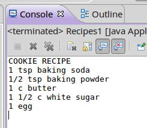
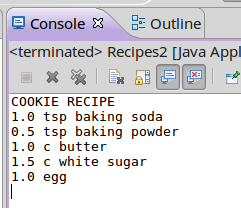
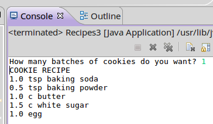
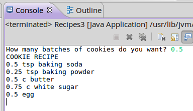
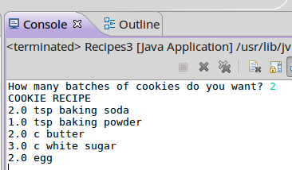

# CS 134 Programming Assignment 4: Input and Output 

## Introduction

This program uses input and output and does some calculations,
in order to get used to programming with just Java.

## Turn-In

Turn in your .java file for this program.

## Review

* Variables, data types
* Input, output
* Math operations

Read [this guide](https://github.com/Rachels-Courses/CS134-Programming-Fundamentals/blob/master/Lessons/00%20Introduction.md)
for steps on creating a project in Eclipse.

---

# Part 1: Just displaying a recipe

Here are the ingredients for sugar cookies:

*    1 tsp baking soda
*    1/2 tsp baking powder
*    1 c butter
*    1 1/2 c white sugar
*    1 egg

For this first part, you're only outputting this recipe as-is.

---

# Part 2: Replacing amounts with variables

Now we're going to modify that program, but use variables
to store the amounts of each ingredient.

Create the following variables (as doubles):

* teaspoonsOfBakingSoda
* teaspoonsOfBakingPowder
* cupsOfButter
* cupsOfWhiteSugar
* amountOfEggs

Initialize these variables to the amounts in the recipe. Instead of 
using 1/2 for half, use 0.5.

Update your **System.out.println** so that instead of displaying
the quantity as the string, you're displaying the integer variable
and then the type of ingredient. Use concatenation to display
a variable and then the string, like:

	teaspoonsOfBakingSoda + " tsp baking soda"
	

Using doubles

---

# Part 3: Get ratio from user

Now, we'll let the user tell us how many batches of cookies they're going
to make. For example, if they're going to bake half a batch of cookies,
then we halve all of the ingredients.

Create a double variable called **batches**.

Ask the user how many batches they want to make. Get it and store it in **batches**.
Use a [Scanner](https://github.com/Rachels-Courses/CS134-Programming-Fundamentals/blob/master/Lessons/02%20Input%20and%20Output.md)
to get the user's input.

Update the ingredients variables - you will take their original values
(such as 1.5) and multiply it by the batches ratio (like 0.5 for half).

Store it in the ingredients variables, you need to adjust each of them
by the ratio.

* teaspoonsOfBakingSoda = 1 times the batches
* teaspoonsOfBakingPowder = 0.5 times the batches
* cupsOfButter = 1 times the batches
* cupsOfWhiteSugar = 1.5 times the batches
* amountOfEggs = 1 times the batches

Normal batch:

Half batch:

Double batch:

---

# Grading Rubric

