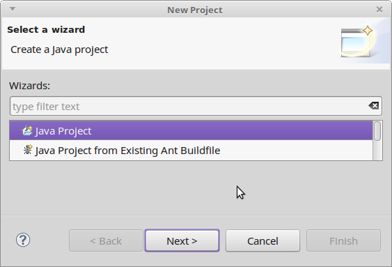
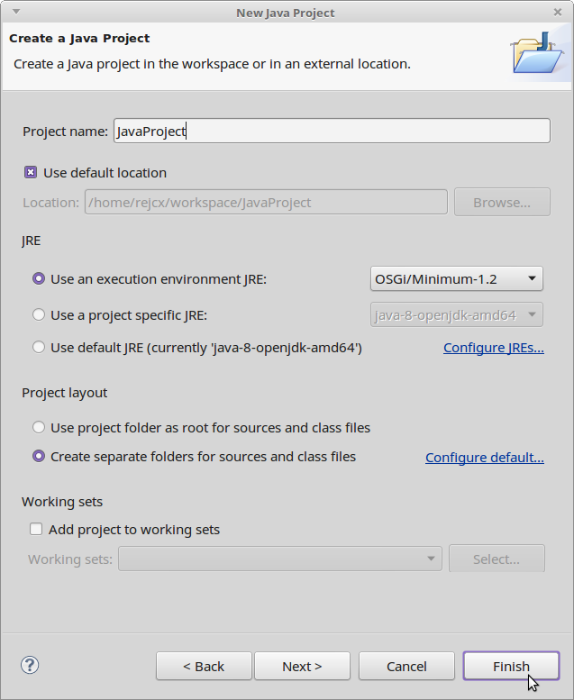
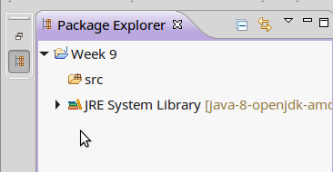
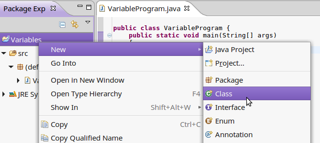
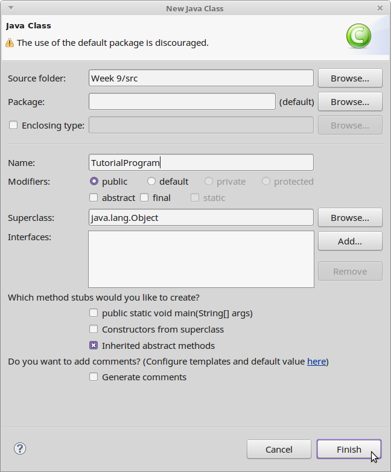
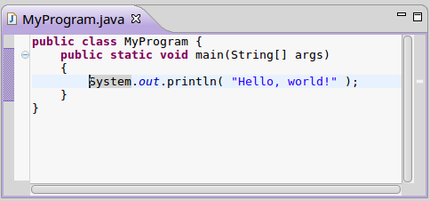
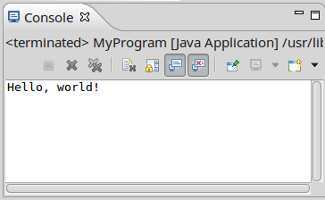

[Next: Variables and Data Types >>](01 Variables and Data Types.md)

---

# Introduction

## Creating simple Java project

In Eclipse, it will ask you for a location for your workspace. The default is fine.

Go to **File > New > Project...**

Select Java Project

Give your project a name, and otherwise use default values. Click **Finish**.

## Viewing the Project

To the left side of the window, there should be a **Package Explorer**. You might have
to click an icon on the left side to get it to appear.

## Creating your program's Class file

After you create a project in Eclipse, you will need to create a **Class** in your project:

Set the **Name** of your class - usually this will describe your program, like "_____Program",
or an assignment name.

You can leave the defaults. Click **Finish** after you've selected a name.

Within this new class, you will create a **main** function, which will be the entry point of your program:

	public class MyProgram {
		public static void main(String[] args)
		{
			// Code goes here
		}
	}
	
This source file ends with **.java** after the class name, and this is the file
you can use to upload your work.

## Writing some sample code

Within your class, within your **main** method, add the following code:

	System.out.println( "Hello, world!" );
	
This is an output statement, and it will print text to the console.

## Running the program

Click on the green button with an arrow in it to run your program:

Your program will appear in the **console** window.

Our Java programs (input and output) will all be contained within the console.
