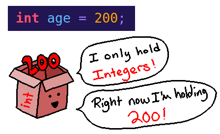
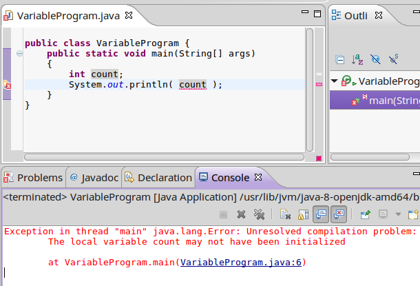
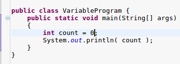

[<< Previous: Introduction](00 Introduction.md) | [Next:  Input and Output >>](02 Input and Output.md)

---

# Variables

Variables are a place where you store *data*. Variables can store different types
of data, from whole numbers, to numbers with decimals, to strings of text, or
even "true/false" values, to start with.

To declare a variable, you must specify its **data type** and **variable name**.
You can name a variable anything as long as it abides by naming standards.

Example:

	public class VariableProgram {
		public static void main(String[] args)
		{
			int count;
			double price;
			String name;
		}
	}

	
When you declare a variable *inside* of a method, it is called a **local variable** -
it is local *to that method*, and does not exist outside of it. It can only be used
within the method.

There are other types of variables as well (such as member variables of a class), but covering variable types
will make more sense once we've covered methods and classes in more depth.

## Types of Variables

### Local Variable

A local variable is a variable declared within a code-block.

A local variable only "exists" within the code block it is declared within. It can be used in code-blocks within its code-block, but not outside of its code-block.

	if ( choice == 1 )
	{
		System.out.println( "Enter the first number: " );

		// Local variable to this if statement
		int num1 = input.nextInt();

		System.out.println( "Enter the second number: " );

		// Local variable to this if statement
		int num2 = input.nextInt();

		mathProblem( num1, num2 );
	} 

	public static void mathProblem( int num1, int num2 ) 
	{
		// answer is a local variable for this mathProblem method.
		int answer; 

		System.out.println( "What is " + num1 + " plus " + num2 );

		answer = input.nextInt(); 

		if ( answer == num1 + num2 ) 
		{
			 System.out.println( "Correct" ); 
		}

		else
		{
			System.out.println( "Incorrect" ); 
		}
	}

### Method Parameter

A method parameter is a variable that is defined within a method's parameter list. These variables can be used anywhere within the method itself, but not outside of the method.

(This will be important to know once we're talking about writing more than one method in a program!)

	// Method parameters are n and d.
	public void set( int n, int d )
	{
		numerator = n;
		denominator = d;
		display();
	}

### Instance (aka member) variable

A variable that is declared as part of a class is known as an instance variable. These variables are declared within a class code-block, but outside of all method code-blocks.

When we create a variable whose data-type is the class, we create an instance of that class. Each instance has its own values for those instance variables.

In other words, for the Fraction class below, we can declare multiple variables of-type Fraction. For each of these Fraction instances, they each have their own numerators and denominators - these values aren't shared between all the Fractions.

(This will be important to know once we're working with classes and object oriented programming.)

	public class Fraction
	{
		private int numerator; // instance variable
		private int denominator; // instance variable

		public String getFormattedFraction()
		{
			return numerator + "/" + denominator;
		}

		// etc...
	}

### Class (aka static) variable

A static variable is also a member variable of a class. However, it adds the keyword static to the declaration.

When a variable is declared as static, each instance of the class shares this same variable, rather than each instance having its own "copy" of the variable.

In the example above, each Fraction variable declared has its own numerator and denominator, independent from all other Fraction variables.

Below, we can declare multiple Student variables, and each student gets its own name. However, with the static school variable, all Students share the same variable - so if school changes for any of them, it changes for all of them.

	public class Student
	{
		String name; // Instance variable
		static String school; // Class variable
	}

## Scope of a Variable

Scope refers to the availability of a variable. Depending on the kind of variable and location of the variable, it is only accessible in certain portions of the code. Generally you can tell what the scope of a variable is by what code-block it is declared within.

*    A class (static) variable and an instance (member) variable are accessible from anywhere within the class it is declared.
*    A method parameter is only available within the method it belongs to.
*    A local variable is only available within the code-block it was declared within. This could be a method, if statement, loop, etc.

When a variable is "Local To" some scope, it means that it can only be used within the code-block defined.

Below, the choice variable is local only to the while loop it is declared within. It can be used with the internal if statement, but nothing outside of the while loop.

The message variable is local only to the if statement it is declared within, and cannot be used outside of that if statement - it does not exist within the larger while loop.

	while ( done == false )
	{
		int choice = input.nextInt(); // Local to this while loop

		if ( choice == 2 )
		{
			// Local to this if statement
			String message = "Your choice: "; 
			System.out.println( message + choice );
		}
	}

# Data Types

Some common data types that you will be working with in Java are:

* **int** - whole numbers. Can be positive, negative, or 0.
* **double** - numbers that can contain a decimal point. Positive, negative, or 0.
* **char** - A single character (such as a letter, number, symbol, etc.). *Must be stored within single-quotes!*
* **boolean** - A variable that can only store true or false as its value.
* **String** - A string contains a sequence of chars. String values must be written within double-quotes.

# Declaring variables

Before using a variable in Java, we must **declare** it. At minimum, our declaration will contain
the variable's name and its data type.

	int totalPizzas;
	
But we can also initialize it during the declaration:

	int studentCount = 30;
	
Or we can declare more than one variable at a time:

	int studentCount, teacherCount;
	
Here is an example of declaring each type of data, and assigning it a value:

	String lastName = "Singh";
	boolean isStudent = true;
	char currentGrade = 'A';
	double gpa = 3.58;
	int age = 23;
	
## Variable naming conventions

Variable names must follow these rules:

1. A variable name must begin with a letter (a-z, A-Z), underscore (_), or a dollar sign ($).
2. You can include numbers in a variable name (0-9), but it cannot be the first character.
3. The variable name can have virtually any length.
4. You can use upper-case and lower-case letters in your variable names, but there is a naming convention that
you should try to follow. Also, remember that variable names are case-sensitive.
5. Reserved keywords (such as "if", "int", "public") cannot be used as variable names.

## Naming Conventions

In programming, it is common to see "camel case" used in variable, method, and class names.

This is when you capitalize the first letter of every word in a name, with the possible exception of the first letter.

For example:

	String courseName; // First letter is lower, next word has capitalized first letter
	
	float milesPerHour;
	
	int daysPerYear;

It is common to use lower-case first letters in variable names and, in Java, in method names.

However, in class objects, it is standard to capitalize the first letter of every word:

	class NonPlayerCharacter
	
	class TextViewer
	
	
## Variable Assignment

During a variable declaration, or once a variable has been declared,
you can assign values to it.

	// Assign a value immediately during declaration
	float milesPerHour = 35.0;
	
	// Declare a variable without initializing it
	int daysPerYear;
	
	// Assign a value to the variable "daysPerYear"
	daysPerYear = 52;
	
### Beware - Uninitialized variables!

Take care, beware! If you don't assign a value to a variable, and then
you try to *use* that variable later on in the program, Java won't
let you build your program!

To fix this, make sure you're initializing your variables!

---

# Review

### Vocabulary

Make sure that you know these terms! They are important!

* **Variable**
* **Data Type**
* **Declaration**
* **Integers, doubles, booleans, characters, and Strings!**
* **Scope**
* **Local Variable**
* **Assignment**
* **Initialize**
* **Uninitialized**

### Theory

Make sure you remember these rules!

* A variable must be **declared** first!
* A variable declaration must include at least the data-type and the variable's name!
* A variable must be **initialized** before it can be used in the program!
* You can name a variable anything you want - as long as it fits the naming rules!

### See Also...

Future lessons will talk more about variables and programming. This is just
general information to get you started!

You might also check out these resources on Java:

* [Accepting Input from a User](http://www.homeandlearn.co.uk/java/user_input.html)
* [Java Made Easy - Java Scanner](http://www.java-made-easy.com/java-scanner.html)
