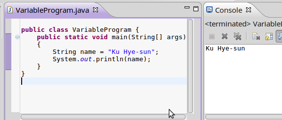
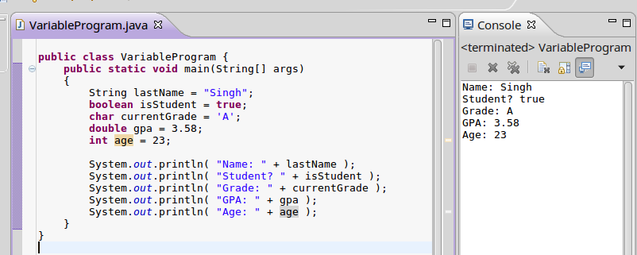
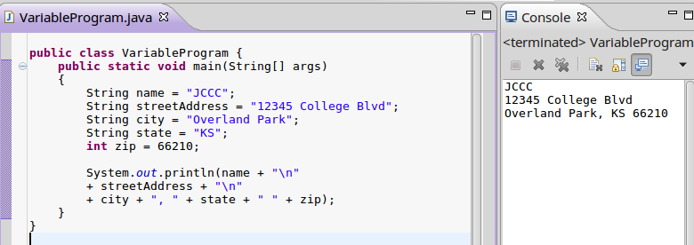
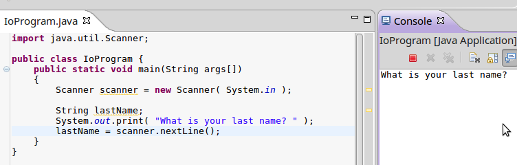
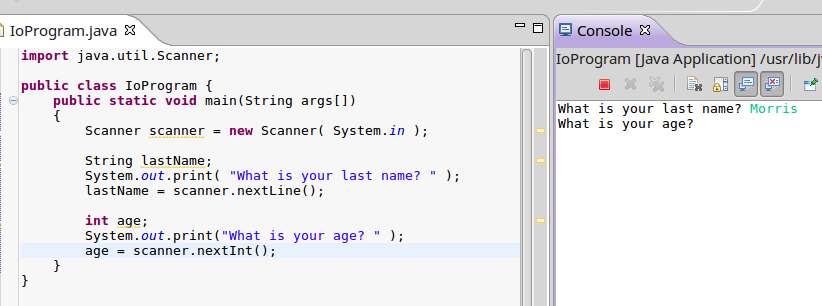

[<< Previous: Introduction](01 Variables and Data Types.md) | [Next: Math Operators >>](01 Variables and Data Types.md)

---

# Text Output

A program isn't very interesting if you can't interact with it.

When first learning to program, you're generally going to be sticking with
text-based programs in the **console** - that text window that displays
your output when running a program.

To display text with Java, you need to use the **System.out.print** or **System.out.println** methods:

	System.out.println( "Line of text with a new line at the end!" );
	
	System.out.print( "No" );
	System.out.print( "new" );
	System.out.print( "line" );
	System.out.print( "here!");
	

Notice that, if you use **print**, you have to manually add in new-lines or even spaces!
But if you use **println**, it will automatically start displaying text on the next line
next time there's a print statement.

## Printing variables

If you have a variable storing data in your program, you can output
that variable's data through **print**/**println** as well.

You can print out any of the base data-types we have covered so far!

## Printing variables AND text

You can also combine text (in double-quotes " ") and variable values
together in the same print statement like this:
		

You can keep combining text and variables together as much as you want with the + sign.
This is known as **concatenation**.

What are those "\n" parts of the string? \n is a shortcut you can use to
add a new line in your text! I used this so that the address
would be formatted properly, with the name up top, then
the street address in the middle, and then city/state/zip on bottom.

---

# Input

In order to get input from the user via the **scanner** object, you first
need to include the scanner library at the top of the source file:

	import java.util.Scanner;
	
(A library is pre-written source code. In this case, somebody else has already
written the code to help you get user input!)
	
Then, you have to declare a **Scanner** variable inside your main method:

	Scanner scanner = new Scanner( System.in );
	
(Note: it doesn't *have* to be in the main method, but we are only working
in this method for now!)

Then, to get user input, there are a few different scanner functions we can use.

* Read an integer: scanner.nextInt()
* Read a double: scanner.double()
* Read text (no spaces): scanner.next()
* Read text (with spaces): scanner.nextLine()

Here is some example code putting it all together.

## Getting a string

Notice that I have to create a variable to store the contents in first (**lastName**),
then I am also displaying a message ("What is your last name?") to let the user know that I'm expecting
them to enter some text. Finally, I get the user's input with **scanner.nextLine()**, and I assign it to the **lastName** variable.

## Getting an integer

Here, we create an integer variable **age**, ask the user for their input,
and then store their result in the age variable after we use **scanner.nextInt()**.

## Getting a double

Finally, we create a double, prompt the user for input, and then use **scanner.nextDouble()** and store
the result in the gpa variable.

---

# Review

### Vocabulary

Make sure that you know these terms! They are important!

* **Console**
* **Concatenation**
* **Special characters/Escaped characters**:
	* "\n" = new line
	* "\t" = tab
* **Scanner**

### Theory

Make sure you remember these rules!

* To display text on its own line, use **System.out.println**
* To display text without ending the line, use **System.out.print**
* To get user input, first you must:
	* Include the java.util.Scanner library
	* Declare a Scanner variable
	* Use the appropriate scanner function to get integers, doubles, or strings.

### See Also...

* [The Java Tutorials - Variables](https://docs.oracle.com/javase/tutorial/java/nutsandbolts/variables.html)
* [Jenkov.com - Variables](http://tutorials.jenkov.com/java/variables.html)
* [Tutorials Point - Variables](https://www.tutorialspoint.com/java/java_variable_types.htm)
