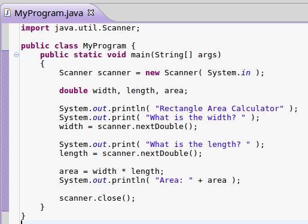
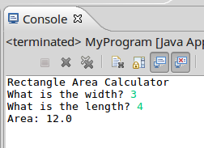

[<< Previous: Input and Output](02 Input and Output.md) | [Next: Branching >>](04 Branching.md)

---

# Math in Java

Java has the following math operators available:

<table>
	<tr>
		<td>Addition</td>
		<td>Subtraction</td>
		<td>Multiplication</td>
		<td>Division</td>
		<td>Modulus</td>
	</tr>
	
	<tr>
		<td>+</td>
		<td>-</td>
		<td>*</td>
		<td>/</td>
		<td>%</td>
	</tr>
</table>

There are also special functions such as for square roots, exponants, and
trig functions.

You can also use parenthesis ( ) in programming to explicitly specify
the order of operations for your math calculations.

**Note:** Remember when declaring a variable, the variable's name goes on the LHS
(Left-Hand-Side) and the computation goes on the RHS (Right-Hand-Side).

## Simple math programs

Let's use Java to compute solutions for the user, using some common math formulas.

Remember that, to get user input, we need to use the Scanner object.

### Calculating area of a rectangle

